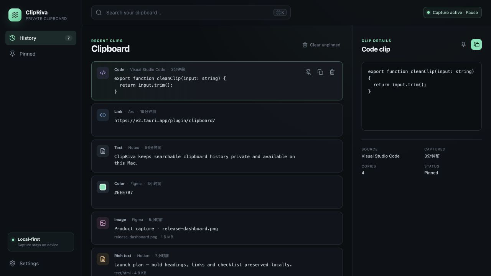

# ClipRiva

简体中文 | [English](README.md)

ClipRiva 是面向 macOS 的本地优先剪贴板历史工具。Core 可在无账号、无数据分析、无网络连接的情况下，快速查找和复用复制过的文本、图片、富文本及文件引用。

ClipRiva Core 是完整的离线产品。可选的 **ClipRiva Labs** 是默认关闭的本地实验功能，不会向远程服务发送剪贴板内容。

**Local Link v1.5 Release Candidate** 是独立、默认关闭的同局域网文本交接能力。用户显式启用后才启动原生 Bonjour/TCP 服务；Noise 认证配对要求两台 Mac 同时确认安全码，每条收到的文本仍需接收方选择 Copy、Save 或 Reject。待决正文只在原生内存保留最多 60 秒。单元、浏览器、环回或单 Mac 测试不能作为双 Mac 证据；在完成真实双机 50 次配对 / 200 条传输与隐私复核前仍为安装包分发和真机使用验收 No-Go。它没有账号、云中继、离线正文队列、自动重试或自动历史同步。

> 项目状态：`2.0.0-alpha.1` 已冻结为[公开源码开发预览](https://github.com/Sealdot/clipriva-source)。源码 prerelease 不含安装包或应用二进制。每个 Release 链接确切提交的 CI 与下载源码验证证据。原生 UI/安装、Local Link 双真机、签名、公证和真人验收仍未验证。目标为 macOS 13+；已验证 runner 为 Apple Silicon 上的 macOS 14。

[公开源码预览记录](docs/audit/source-public-preview-2026-10-08.md)说明安全警告、复现步骤和剩余门槛。[私有 runner 记录](docs/audit/source-ci-verification-2026-10-08.md)与[首次导出审计](docs/audit/source-candidate-2026-10-08.md)保留为历史证据。公开仓库使用白名单导出的独立历史，不含旧私有历史。源码公开不构成 Local Link 验收；应用安装包另按发布清单验收。

## 它解决什么问题

- 通过全局 Quick Paste 快捷键、搜索和键盘导航快速复用历史内容。
- 将历史记录保留在本机，可暂停采集、排除应用、设置保留期限，并在高置信度敏感内容出现时自动暂停。
- 支持文本、PNG 图片、RTF/HTML 与 macOS 本地文件引用的采集和恢复。
- 固定的 Tauri IPC 命令面不提供任意 SQL 或任意文件系统访问。
- 核心功能不依赖账号、模型提供商、同步服务或 Agent 集成。

## 当前能力

- 后台剪贴板采集与尽力而为的来源应用识别。
- SQLite 本地持久化、精确版本分组、FTS5 搜索、有边界的本地标签、置顶、回收站和保留策略。
- 由有限规则动态计算的 Smart Collections，以及需显式打开、可本地搜索的条目备注。
- 对文本、代码、命令、链接和颜色进行保守的本地分类。
- 全局 Quick Paste、菜单栏生命周期、关闭到托盘和可选开机启动；Quick Paste 与顺序 Stack
  使用可配置且不能冲突的快捷键，Stack 支持收集、排序和逐项激活，队列不落盘。
- 默认安全恢复模式；用户主动启用并授予辅助功能权限后，可使用直接粘贴。
- 应用拒绝列表、手动暂停与高置信度敏感内容自动暂停。
- 默认关闭的 Local Link 候选：仅限本设备的 Keychain 身份/重置路径、Bonjour/mDNS 发现、Noise 认证配对、有上限的文本传输、收件决策、无正文状态历史和待决正文自主过期。
- 不启动 Tauri 也可使用浏览器内存仓库进行 UI 开发。
- 前端测试、Rust 单元测试、格式检查、静态检查和 CI。

## ClipRiva Labs

Labs 默认关闭。启用后可使用确定性的本地摘要、实验性本地检索，以及支持 1–8 个允许列表步骤、实时预览、上下文快捷键和无正文完成审计的 Filter Composer。

本地自动化独立保持默认关闭。用户显式启用后，随应用提供的 ClipRiva CLI 与 Apple Shortcuts
“运行 Shell 脚本”动作通过仅限当前用户的本地 socket 使用逐项授权；不提供任意 Shell、SQL、
文件系统、网络或 Agent/MCP 接口。

Labs 仍保持离线：没有云端执行器、模型提供商连接、分析端点、同步服务、MCP 服务器或 Agent 交接。

## 安装与运行

目前没有官方安装包或可下载应用。开发者可在 macOS 上从源码构建，生成的未签名应用仅供本地测试。公开签名和公证后的安装包仍需单独通过发布门槛。

### 环境要求

- macOS 13 或更高版本
- Node.js 24.15.0（见 `.nvmrc`；安装时会强制检查依赖的 Node 版本要求）
- pnpm 11.9.0
- Rust 1.97.1（由 `rust-toolchain.toml` 固定）
- Xcode Command Line Tools

维护中的兼容矩阵覆盖 Ventura 13、Sonoma 14、Sequoia 15 和 Tahoe 26，并同时考虑 Apple
Silicon 与 Apple 仍支持的 Intel 机型。编译、安装包、真机和签名分发证据的区别见
[macOS 支持策略](docs/macos-support.md)。

```bash
xcode-select --install
curl --proto '=https' --tlsv1.2 -sSf https://sh.rustup.rs | sh
rustup component add rustfmt clippy
pnpm install --frozen-lockfile
pnpm desktop:dev
```

仅运行浏览器开发适配器：

```bash
pnpm dev
```

构建未签名的本地应用包：

```bash
pnpm release:bundle:unsigned
```

应用包会生成在 `src-tauri/target/release/bundle/macos/ClipRiva.app`。它未签名，仅用于本地开发，不能作为公开分发包。

从[公开仓库](https://github.com/Sealdot/clipriva-source)或[仅含源码的 prerelease](https://github.com/Sealdot/clipriva-source/releases)下载源码。解压前核对 `SHA256SUMS`，按[复现记录](docs/audit/source-public-preview-2026-10-08.md)安装锁定依赖与运行检查。普通问题可使用[问题跟踪器](https://github.com/Sealdot/clipriva-source/issues)；安全漏洞请按 [SECURITY.md](SECURITY.md) 私密报告。

## 截图



截图来自 macOS 浏览器开发适配器，展示的是合成剪贴板条目，仅用于说明界面；它不能证明签名应用或 Local Link 双真机行为。

## 日常使用

- 默认使用 `Command + Shift + Space` 打开 Quick Paste，可在设置中修改。
- 搜索后使用方向键导航，按 Enter 恢复选中内容。
- 恢复模式只将内容放回剪贴板，再通过 `Command + V` 粘贴。
- 直接粘贴模式需要用户显式启用并授予 macOS 辅助功能权限；被拒绝时会退回到恢复剪贴板。
- 主窗口中按 `Command + K` 聚焦历史搜索。
- 清理历史会先展示影响预览，默认保留置顶内容，并将可恢复内容移动至本地回收站。

完整流程与故障排查见 [v1.5 首次使用与常见问题](docs/help/v1.5-getting-started.md)，候选限制见
[1.5.0 已知问题记录](docs/release/known-issues-1.5.md)。

## 本地数据与隐私

macOS 上的应用数据位于：

```text
~/Library/Application Support/com.clipriva.desktop/
```

其中包含 `clipriva.sqlite3` 和内容寻址的本地 Blob。手动备份或删除前请退出 ClipRiva；删除会重置历史和普通设置，且不可恢复。Local Link 的长期本机身份密钥位于 macOS Keychain，删除上述目录不一定会删除该 Keychain 项。Local Link 的安全详情提供显式身份重置：删除 Keychain 项、使本机 peer 绑定全部需要重新配对，但不会删除 History。详见隐私文档中的恢复说明。

- 被拒绝应用的数据会在写入前丢弃。
- 检测到高置信度敏感内容时会在持久化前暂停采集。
- 仅在启用 Labs 或主动访问已启用的 Labs 视图时，才会生成本地增强信息。
- 恢复模式不需要辅助功能权限；直接粘贴为可选能力。
- Core、Labs 和本地诊断未配置遥测、远程服务、账号或模型提供商。
- Local Link 是唯一的应用网络边界；仅在用户显式启用后启动同局域网原生服务，并在关闭/重置时停止。它没有 ClipRiva 云中继、互联网回退或离线正文队列。

请参阅 [PRIVACY.md](PRIVACY.md) 了解数据处理，参阅 [SECURITY.md](SECURITY.md) 了解漏洞报告和信任边界。

## 开发

请使用已固定的 pnpm 工作流，以确保依赖解析可复现：

```bash
pnpm install --frozen-lockfile
pnpm dev
pnpm lint
pnpm typecheck
pnpm test
pnpm build
pnpm lint:rust
pnpm test:rust
```

依赖安装完成后，也可以使用 `npm run dev`、`npm run lint`、`npm run typecheck`、`npm run test` 和 `npm run build` 调用同名脚本。但不要使用 `npm install`：本仓库的锁文件和包管理器均为 pnpm。

目录结构：

```text
src/                         React 应用和剪贴板 UI
src-tauri/src/clipboard/     平台采集、策略和 Quick Paste 适配器
src-tauri/src/db/            SQLite 仓库和迁移
src-tauri/src/media/         内容寻址的本地表示
docs/                        架构、路线图、测试和发布门槛
```

修改隐私或平台边界前，请阅读 [用户故事](docs/user-stories.md)、[架构](docs/architecture.md)、[路线图](ROADMAP.md)、[贡献指南](CONTRIBUTING.md) 和 [开源边界报告](docs/open-source/module-boundary.md)。

## 项目边界

ClipRiva v1 不包含 Windows 或 Linux 支持、账号、跨设备同步、云端 AI、MCP、Agent 集成或公开插件 SDK。这些不是当前路线图承诺。

Local Link 的“单条 Item 请求—接收端决定”不是跨设备历史同步。图片、文件、富文本、自动剪贴板镜像、互联网中继、离线投递或自动重试均不在范围内。

如有重复且明确的真实需求，未来会以依赖稳定 ClipRiva Core 服务的独立层实现，不能直接访问本地数据库。

## 路线图与贡献

路线图代表方向，不构成固定交付承诺；具体内容可能根据用户反馈和项目资源调整。详见 [ROADMAP.md](ROADMAP.md)。

请在贡献前阅读 [CONTRIBUTING.md](CONTRIBUTING.md)。安全问题请遵循 [SECURITY.md](SECURITY.md) 的私密报告流程。

## 许可证、品牌与已知限制

代码采用 [Apache License 2.0](LICENSE)。ClipRiva 名称和图标的使用请遵循
[TRADEMARK.md](TRADEMARK.md)；代码许可证不授予名称或 Logo 的使用许可。

- 仅支持 macOS 13+；Windows 和 Linux 不是 v1 承诺。
- 公开的签名和公证安装包尚不可用。
- 手动兼容性矩阵和大历史记录下的 Quick Paste 延迟调优尚未完成。
- ClipRiva Labs 为实验功能，默认关闭，且不承诺跨版本稳定性。
- Local Link 为实验功能且默认关闭。原生配对与文本交付路径已经实现，但在 Keychain、抓包/隐私、睡眠/网络恢复和真实双机验收门槛通过前仍是 Release Candidate / 公开发布 No-Go。
