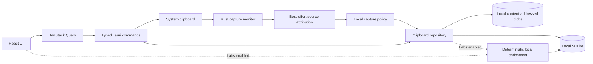
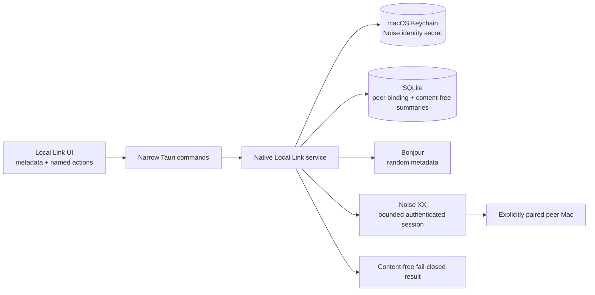

# ClipRiva Core architecture

## Design goals

1. Clipboard capture must remain useful with no account, network or model.
2. Private data crosses a process or network boundary only through an explicit adapter.
3. Search and capture should not depend on the UI window being focused.
4. ClipRiva Labs must remain optional and must not add a network or account dependency to Core.
5. Future products may consume stable application services but must not access database tables.
6. The codebase should stay approachable for a solo maintainer.
7. Local Link must remain an isolated, default-off native network boundary; Core and Labs must not
   acquire a network dependency when it is disabled or fails.

## Runtime flow

Local Link is intentionally separate from the Core flow. It remains default off; explicit enable
may start only the native listener and Bonjour/mDNS runtime shown below:

## Boundaries

### React application

The UI owns presentation state, selection, search input and optimistic interaction feedback. It does
not know where SQLite lives and does not receive a general-purpose database permission.

`src/features/clipboard/api.ts` is the only runtime bridge for the current feature. In a browser it
uses an in-memory repository; in Tauri it invokes a fixed command allow-list. The workspace also
owns the settings dialog, paused-capture status and local enrichment inspector.

### Tauri command layer

`src-tauri/src/commands.rs` converts IPC requests into domain operations. Keep commands narrow and
return serialized domain models. Do not expose arbitrary paths, SQL or shell execution.

### Local repository

`src-tauri/src/db` owns schema migration, storage limits, deterministic enrichment persistence,
image-representation records, recovery state and exact-version grouping. Migration 11 keeps each
text-like capture as its own record and uses an opaque `group_id` plus a monotonic `version` to fold
only storage-confirmed exact duplicates in the UI. Capture normalizes the local encoding boundary
(for example CRLF to LF), but does not trim whitespace, fold case, use semantic similarity or use
image fingerprints. The WebView never receives a content hash and must not infer groups from visible
content.

Each record also owns a `global_id`, local `device_id`, `retention_until`, and soft-delete fields.
These are local-only, sync-ready metadata—not an account, sync protocol, remote identity or network
feature. Every active-history cleanup scope (single, selected, all-unpinned and retention policy)
first receives the same content-free preview. Confirmed cleanup moves rows into the local Recycle
Bin; recovery keeps the original row, capture time, source, pin state and group membership. Recycle
expiry starts a fixed seven-day recovery window (one day in Strict mode), independent of the former
active-history `retention_until`, and permanent removal cleans media blobs with no remaining
representation reference. Retention policy
cleanup is initiated through the explicit review flow after a rule change or from History, so a newly
captured clip is never silently hidden without that preview.

The FTS5 table ranks content matches with BM25 and supports safe token-prefix queries. Source-app
matching remains available as a lower-priority fallback. The local semantic adapter is separately
versioned: its current lexical fallback sends no content anywhere and embedding adapters can be
introduced without changing the stored clip schema.

The app-data directory, blob root, hash directory and shard directories are app-owned private
directories (`0700` on Unix). Blob files are `0600`. Storage keys are canonical relative SHA-256
identifiers; they never incorporate clipboard filenames. Every read and existing-file reuse rejects
symlinks and non-regular files, compares the opened file's device/inode with the checked path on
Unix, enforces the automatic-size limit and verifies the full content digest before returning
bytes. Publication uses a synced private temporary file and an atomic no-clobber hard link, so a
damaged or unexpected existing destination is never silently overwritten. Existing app-owned blob
permissions are tightened on open/read; SQLite file-mode migration remains a separate release task.

### Capture service

The capture service polls the macOS pasteboard every 650 ms. The Tauri clipboard plugin handles
plain text and images; a narrow `NSPasteboard` adapter handles RTF, HTML and local file references.
Images and rich representations are written to deterministic content-addressed blobs only after
pause and deny-list checks pass. File references store a local path list, not the referenced file
contents.

The service resolves the macOS foreground application as optional metadata and applies pause,
deny-list and sensitive-content rules before persistence. Image capture does not perform OCR or
visual sensitive-data detection.

### ClipRiva Labs

`src-tauri/src/context` produces schema-versioned deterministic classifications, redacted summaries,
entities and tags only while Labs is enabled or an enabled Labs view requests an enrichment. The raw
clip stays local; derived fields use the redacted representation where appropriate. The
experimental retrieval adapter uses an offline lexical fallback. It is not backed by a vector model
and never sends text to a provider.

`src-tauri/src/actions.rs` owns allow-listed local text transforms. Its SQLite audit log is
append-only at the database layer and keeps hashes plus redacted previews. Compatibility code for
the earlier preview-only boundary remains non-executable and is not exposed in the Core UI.

### Desktop lifecycle

On desktop, closing the main window hides it to the menu bar. The tray offers Show ClipRiva, Quick
Paste, opt-in launch at login and explicit Quit. The persisted global shortcut toggles the small
Quick Paste window without requiring the main window to be open.

Quick Paste records the previously focused process before opening. Restore mode only writes the
selected representation to the system pasteboard. Opt-in direct-paste mode first checks macOS
Accessibility trust, returns focus to the recorded process and sends Command-V. Missing, denied or
revoked trust falls back to a restored clipboard without synthesizing input. Its command result is
truthful and bounded: `clipboardRestored`, `pasteSent` (a command was sent, not acceptance by the
target application), or `pasteNotSent` with a broad permission, focus or compatibility reason.

### Local diagnostics

Migration 10 provides an optional, default-off local diagnostics store. It accepts only an
allow-listed event/result pair, a UTC day bucket and app version. It cannot receive clip content,
hashes, IDs, source-app names, paths, filenames, document names, account identifiers or network
identifiers. Settings reads aggregates only and can clear or export the anonymous local record.

### Local Link Preview / two-Mac Alpha

`src-tauri/src/local_link*` owns a default-off candidate network boundary. New installs and upgrades
from the v0.6/v0.7 no-network preview do not inherit consent to start a listener. Explicit enable
starts the documented native listener and Bonjour/mDNS runtime; pairing creates trust only after a
Noise XX handshake and both users confirm the SAS. A body may reach only an authenticated,
explicitly paired peer, otherwise the operation fails closed with content-free state.

The native identity adapter generates and retrieves a versioned long-lived Noise static secret from
macOS Keychain. SQLite stores only the peer public-identity binding, local trust metadata and
content-free transfer summaries. The WebView cannot access Keychain, raw sockets/endpoints, trust
anchors, protocol frames or undecided plaintext. Identity reset and peer revoke are distinct:
revoke invalidates one peer; reset keeps Local Link off, deletes the
`AccessibleWhenUnlockedThisDeviceOnly` identity, clears pending/receipt state and marks all local
peer bindings `needsRePairing`. Signed/reinstall Keychain behavior remains a Preview/Alpha gate.

The discovery component uses fresh random instance/host labels and allow-listed `v`/`pair` TXT
metadata while enabled. The protocol component uses
`Noise_XX_25519_ChaChaPoly_BLAKE2s`, bounded frames/chunks, strict pairing/Receipt/Ack/Status schemas
and first-terminal-wins convergence. No plaintext/legacy codec exists. Unit and same-host tests do
not prove remote authentication, Bonjour permissions or delivery on two physical Macs. Production
writes no IP address or port to SQLite, diagnostics or Transfers.

A Send attempt reruns policy/type/size checks for one selected UTF-8 text Item immediately before
transport; there is no payload queue. Transfer/replay tables contain content-free metadata.
Authenticated inbound plaintext is native-memory-only and has an autonomous deadline worker.
`reveal_local_link_transfer` returns no text over IPC and schedules an AppKit surface from a
short-lived zeroizing native owner; complete lock/user-switch/timeout/revoke closure of an already
visible surface remains a gated contract, not a completed real-macOS claim.

The protocol contract and threat model are
[`docs/local-link/PROTOCOL.md`](local-link/PROTOCOL.md) and
[`docs/local-link/THREAT_MODEL.md`](local-link/THREAT_MODEL.md). The feature remains default off and
labeled Preview/Alpha until the selected implementation and 50-pairing / 200-transfer two-real-Mac
matrix pass. Browser fixtures and loopback do not provide network or encryption evidence.

## Extension rules

- Add image and file payloads as separate content records referencing blobs in app data, not as large
  SQLite text fields.
- Keep source-app detection behind its platform trait; macOS is implemented and other platforms
  currently fail safely to no attribution.
- Labs code may use `SemanticSearchAdapter`, but Core does not ship a provider or public plugin SDK.
- No sync, account, cloud model, MCP or Agent adapter belongs in the v1 repository scope.
- A separately validated future product must call versioned application services and must never
  synchronize or query the SQLite database file.
- Local Link is not a sync adapter. Its current contract permits only one explicitly selected text
  Item and an explicit Copy/Save/Reject decision over an authenticated paired-peer session.

## Security notes

- Tauri capabilities are scoped to the `main` and `quick-paste` windows.
- Webview clipboard permissions allow only plain-text read/write. Rich formats are handled by a
  fixed native adapter and never expose arbitrary file reads to the webview.
- The CSP blocks arbitrary remote scripts and connections.
- The repository rejects empty entries and text payloads larger than 1 MB.
- Pinned records survive routine history clearing and retention pruning.
- The cleanup preview intentionally exposes representative metadata only; it never repeats clipboard
  contents, previews or hashes in a confirmation surface.
- Strict sensitive-content protection remains enabled after a confirmed resume and shortens local
  Recycle Bin recovery to one day.
- Local diagnostics are opt-in, finite-schema and stay on the device; they are not analytics.
- High-confidence secret patterns pause capture before persistence; the local enrichment pipeline
  additionally redacts sensitive derived previews.
- Local Link starts no listener/discovery/session until explicit enable. Every pairing/Send path
  fails closed when consent, identity, peer trust, policy or transport validation is absent; there
  is no plaintext fallback.
- Inbound pending plaintext stays in bounded native memory and is excluded from the WebView, SQLite,
  files, Transfers, logs and diagnostics.
- The repository-wide model is [`docs/security/THREAT_MODEL.md`](security/THREAT_MODEL.md); Local
  Link retains its detailed protocol model.

## Release decisions still open

- Clipboard-History encryption-at-rest strategy. The Local Link identity uses Keychain, but this
  does not encrypt SQLite or blobs.
- Final Developer ID signing and notarization owner.
- Whether encryption at rest can be added without harming unattended clipboard capture.
- Local Link may move from Preview/Alpha to Beta only after its protocol, Keychain attributes,
  discovery schema, permissions and two-real-Mac evidence pass the recorded gate.

Windows, Linux, cross-device sync, cloud AI, MCP and Agent integration are explicitly outside the v1
architecture rather than open implementation decisions.
