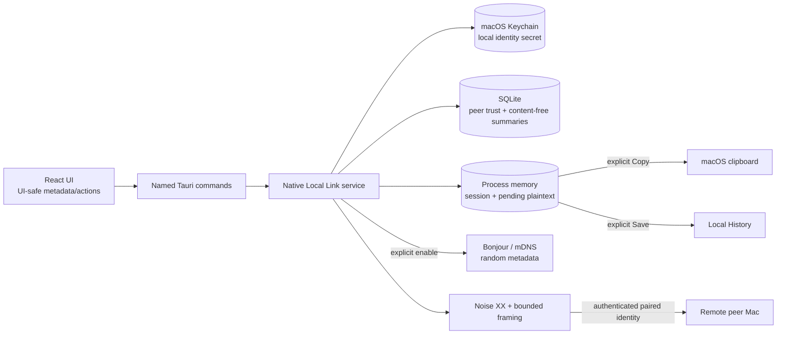

# Local Link v1.5 threat model

- **Status:** Preview / two-Mac Alpha review baseline
- **Protected feature:** default-off, authenticated local-network transfer of one explicitly
  selected UTF-8 text Item
- **Related contract:** [PROTOCOL-v1.5.md](PROTOCOL-v1.5.md)
- **Repository model:** [`../security/THREAT_MODEL.md`](../security/THREAT_MODEL.md)

This threat model covers the gated Local Link v1.5 boundary. The runtime remains default off.
Explicit enable starts the documented native listener and Bonjour/mDNS discovery; an authenticated
Noise session and explicitly confirmed peer binding are required before delivery. Failure is
content-free and fail-closed. The model does not cover clipboard confidentiality after an explicit
Copy, History confidentiality after Save, a Mac already controlled by an attacker, or the security
of the local Wi-Fi infrastructure itself. There is no cloud/Internet relay or offline delivery
queue.

The implementation maps discovery metadata to `mdns-sd`, Noise/framing to `snow`, Keychain access
to `security-framework`, and in-process private-key cleanup to `zeroize`. The
`_clipriva._tcp.local.` TXT allow-list is `v` and `pair`. Unit and same-host TCP tests do not prove
listener lifecycle, cross-device authentication, signed/reinstall Keychain behavior, packet
secrecy or cleanup on two real Macs.

## Assets

1. Selected clipboard plaintext before and during transfer.
2. The local long-lived Noise identity private key in macOS Keychain.
3. Trusted-peer public-key bindings and the user's trust decision.
4. Pending receive plaintext during the 60-second decision window.
5. Integrity and idempotency of Copy, Save, Reject, Cancel and final receipts.
6. Core availability: capture, History and Quick Paste must remain usable when Local Link is off or
   under network failure/attack.
7. Privacy-safe metadata: device labels, fingerprints, transfer state and network endpoints.

## Trust boundaries

The local network, discovered endpoints, device display names and WebView are not trust anchors.
Only the native process may use Keychain secrets, raw sockets or decrypted inbound plaintext.

## Adversaries and assumptions

- An unknown device on the same LAN can observe multicast discovery, connect to the listener, send
  malformed frames and race a legitimate pairing attempt.
- An active network attacker can intercept, delay, drop, replay and modify packets.
- A formerly trusted peer may be revoked but continue trying old credentials.
- A trusted peer may send too many requests or malformed/oversized content.
- Web content or compromised presentation code may try to invoke commands outside the intended UI
  sequence.
- Logs, diagnostics, SQLite/WAL files, backups and screenshots may be shared with support.

The design assumes both Macs and their operating-system Keychains are not already compromised, the
user can compare the pairing values over a trustworthy visual/physical channel, and the selected
Noise/cryptographic library is used without disabling authentication.

## Threats and required controls

The runtime is fail-closed at every transition: no network before explicit enable, no trust before
bilateral pairing confirmation, and no body before current policy and authenticated peer checks.

| ID | Threat | Required control | Verification |
| --- | --- | --- | --- |
| T-01 | Network starts without informed consent | New installs/upgrades default off; only explicit enable may start the listener/mDNS, and disable/reset/exit stop it | Migration, startup, lifecycle and real-Mac socket-observation tests |
| T-02 | Discovery leaks stable identity or device name | Random instance/host plus finite `v`/`pair` TXT allow-list; no body, name, key or persistent endpoint | Unit metadata tests plus real mDNS capture on the candidate |
| T-03 | Unknown peer sends content | Noise authentication and trusted static-key binding before accepting a transfer envelope | Unknown-key and direct-endpoint tests |
| T-04 | Man-in-the-middle during first pairing | Noise XX, transcript-bound SAS/fingerprint and confirmation on both Macs; mismatch creates no trust | Handshake-tamper and mismatch matrix |
| T-05 | Display-name/IP substitution | Treat names and endpoints as labels/routing only; trust the bound static public key | Rename, DHCP/port-change and same-name tests |
| T-06 | Plaintext downgrade or protocol confusion | One reviewed Noise protocol generation; version negotiation inside authenticated data; no plaintext/legacy fallback | Downgrade, invalid-frame and packet tests |
| T-07 | Replay, conflicting Receipt or duplicate side effect | Fresh session/transfer IDs and nonce, TTL, bounded dedupe state, first-terminal-wins Receipt/Ack/Status machine | Duplicate/reorder/conflict tests plus production TCP dropped-receipt StatusQuery fault injection |
| T-08 | Oversized or malformed input exhaustion | Authenticate first where practical, bounded length prefix/allocation, valid UTF-8 and 256 KiB limit | Fuzz/property tests and boundary cases |
| T-09 | Trusted-peer request flooding | One pending request per peer, three globally, five per peer/minute, reject before retaining body | Rate/concurrency tests |
| T-10 | Plaintext written before consent | Native memory-only PendingTransfer; WebView receives metadata only; reveal is opaque-ID/void IPC and Copy/Save/Reject are exclusive | DTO/IPC source tests plus SQLite/WAL/file/log scans on the candidate |
| T-11 | Plaintext remains after terminal event | Autonomous 60-second deadline; cleanup on reject/cancel/disconnect/revoke/disable/exit; workspace sleep/session/termination closes native reveal and clears pending before transport stop | Lifecycle reducer/service tests plus real-macOS reveal/lock/sleep evidence |
| T-12 | Duplicate Copy or Save after receipt loss or crash | Copy durable claim + random pasteboard marker + no-replay recovery; Save History/terminal transaction; idempotency independent of receipt delivery | Claim/transaction/restart tests and dropped-receipt production TCP fault injection; real system crash matrix remains |
| T-13 | Revoked peer continues a session | Close sessions, clear pending payloads, invalidate peer binding and reject the old static identity | Revoke before/connect/awaiting/after tests |
| T-14 | Keychain secret disclosure or silent replacement | Native-only versioned `AccessibleWhenUnlockedThisDeviceOnly` item, no IPC/log/SQLite representation; missing identity with peers fails closed; explicit reset invalidates peer bindings | Source/store/reset tests now; signed macOS Keychain/reinstall matrix |
| T-15 | WebView gains raw network/key capability | Named commands and UI-safe models only; no arbitrary socket, endpoint, key, filesystem, SQL or shell command | Capability and command allow-list review |
| T-16 | Endpoint or identity leaks through diagnostics | Structured allow-list; exclude IDs, names, fingerprints, IP/port and raw errors | Export and logging tests |
| T-17 | Receiver is locked or switching users | Reject before retaining plaintext and return a content-free unavailable result | Lock/user-switch real-Mac tests |
| T-18 | Network attack degrades Core | Isolated service, bounded tasks/resources and cancellation; Core has no transport dependency | Failure/stress plus Core regression suite |
| T-19 | “LAN-only” overclaim | Describe Bonjour discovery and no application relay precisely; keep mutual authentication on every reachable socket | Documentation boundary test and packet review |
| T-20 | Old preview preference silently enables network | Migration 15 resets enabled/discovery false, invalidates unbound legacy trust and clears old key slots | Migration 15 upgrade fixtures |
| T-21 | Post-commit uncertainty is falsely shown as cancelled, failed-before-delivery or successful | Protocol v3 content-free status reconciliation; generation-bounded retry; explicit `outcomeUnknown`; no payload replay | Authenticated StatusQuery tests, shutdown race test and truthful frontend projection; real network-switch/restart matrix remains |

## Key lifecycle analysis

The local identity secret is outside the application-data directory. This improves protection over
placing the secret next to SQLite but creates a separate retention and reset boundary:

- App-data deletion may leave the Keychain identity behind.
- Keychain deletion may leave SQLite peer bindings that can no longer authenticate.
- Reinstallation may regain access to an old item depending on code-signing identity and Keychain
  access rules.
- A malformed or inaccessible item must never trigger silent identity replacement while peers are
  still marked trusted.

The product therefore uses an explicit Local Link identity reset that keeps the feature off, clears
pending/receipt state, deletes the Keychain item, marks local peer bindings `needsRePairing`, and
explains that all peers must pair again. The Alpha identity adapter versions a non-synchronizing
generic-password item and sets `AccessibleWhenUnlockedThisDeviceOnly`. Source/store/reset tests do
not replace real signed-build accessibility, upgrade and reinstall evidence; those remain Beta
gates.

## Plaintext lifetime caveat

“Memory-only pending plaintext” means ClipRiva does not intentionally serialize undecided text to
SQLite, files, logs, diagnostics or the WebView. General operating-system swap, hibernation,
process inspection and crash-dump behavior require separate platform verification; ordinary file
scans cannot prove that those mechanisms never contain process memory. Release copy must not claim
stronger memory secrecy than the implemented and tested controls support.

Buffers holding plaintext and session keys should have the shortest practical lifetime and be
cleared on every terminal path. The pending buffer and native-reveal clone use the existing
   `zeroize` dependency. The v1.5 workspace observer requests reveal closure on sensitive lifecycle
   events, but an ordinary source/unit test cannot prove macOS swap or every AppKit/window-server
   transition. Adding locked memory or another dependency requires its own portability, license and
   effectiveness review.

## Residual risks

- A user can approve the wrong peer if they do not compare the SAS/fingerprint.
- A trusted peer can see the text after the sender explicitly sends it and can retain it after Copy
  or Save outside ClipRiva's control.
- While explicitly enabled, mDNS reveals that a ClipRiva-compatible service exists on the local
  link; random metadata limits but does not eliminate that presence disclosure.
- Availability is not guaranteed on isolated enterprise networks, VPN configurations or networks
  that suppress multicast.
- A compromised Mac, accessibility malware, clipboard monitor or privileged debugger is outside
  this feature's protection boundary.

These risks require accurate UI copy; they must not be hidden by claims of “end-to-end privacy” or
“LAN-only security.”

## Security review and No-Go rules

Before changing Preview/Alpha copy to Beta, reviewers must approve the actual Noise parameter
string/library, Keychain attributes, Bonjour service/TXT schema, port binding, transcript/SAS
derivation, frame schema, retry/dedupe retention, lock-state detection and cleanup paths. The
two-real-Mac matrix of at least 50 pairing ceremonies and 200 text transfers, plus packet/disk/log
evidence, must match the reviewed build SHA.

Any of the following is an absolute No-Go:

- a plaintext or unauthenticated fallback;
- an incorrect peer becoming trusted;
- a private identity key in source, SQLite, IPC, logs or diagnostics;
- pending plaintext in SQLite, Transfers, files or the WebView;
- a duplicate Copy or Save for one transfer ID;
- successful authentication by a revoked identity;
- Local Link network activity before explicit consent;
- a failure reported to the sender as delivered.
