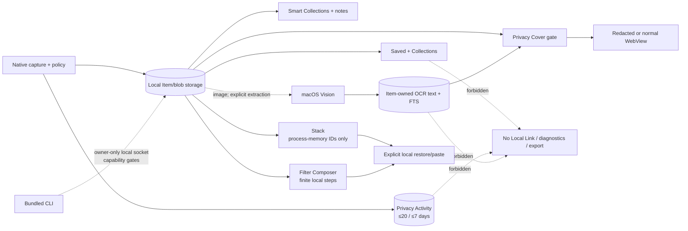
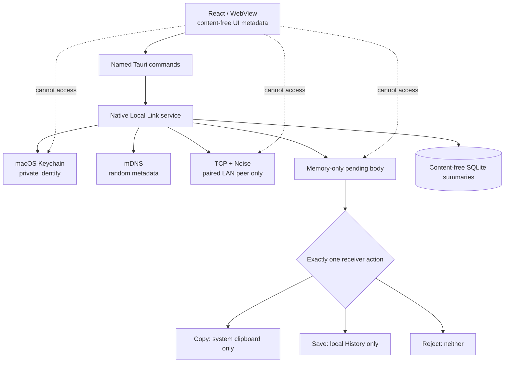

# Open-source module boundary

- **Assessment date:** 2026-08-23
- **Status:** ClipRiva `2.0.0-alpha.1` engineering-candidate boundary record; this document does not
  authorize publication, a tag, signing, notarization or release.
- **Local Link status:** default-off Preview / No-Go; the required same-artifact real two-Mac and
  signed-build evidence has not been completed.

ClipRiva is a local-first macOS desktop application. Core and Labs start without an account, server,
telemetry, cloud model, official sync, payment, administration or production deployment module. The
v1.0 Local Link implementation is a narrow native device-to-device boundary: a user’s explicit
enable can start private native TCP and Bonjour/mDNS, but clipboard body can travel only to an
authenticated, explicitly paired Mac on the same LAN. It does not create an account layer, Internet
route, cloud relay, automatic synchronization, offline queue or plaintext/legacy fallback.

## Boundary inventory

| Module | Current path | Function | Boundary | Risk | Requirement |
| --- | --- | --- | --- | --- | --- |
| React application and runtime bridge | `src/app/`, `src/lib/`, `src/main.tsx` | Window UI, local workspace-size preference, state, Privacy Cover bootstrap and desktop/browser runtime selection | Core UI | Medium | Keep the typed, named runtime boundary; no arbitrary native capability. Protected content must not be created in DOM/accessibility text while Cover is active. Stored geometry/Cover preference contains no History or identity data. |
| Clipboard UI and browser repository | `src/features/clipboard/` | History, Saved, Collections, Smart Collections/notes, search, Settings, Quick Paste, process-memory Stack, Filter Composer, Privacy Activity, browser adapter and Labs surfaces | Core / Labs | Medium | Preserve local-first defaults and browser/native contract tests. Stack contains only at most 20 Item IDs/cursor and clears on restart. Note bodies load only through the explicit Inspector/search boundary; Collection names, Smart Collection definitions, notes and Privacy Activity source labels remain sensitive local metadata. |
| Native capture and privacy policy | `src-tauri/src/clipboard/` | macOS pasteboard capture, source attribution, policy, deterministic text/code/command type and size checks, rich content and image handling | Core native | High | Evaluate pause, excluded-app, sensitive-content and text size/type rules before Item/Occurrence/Variant/blob/Labs/diagnostics persistence. |
| Local persistence and media storage | `src-tauri/src/db/`, `src-tauri/src/media/`, `src-tauri/src/models.rs` | Local SQLite schema, Saved/Collections, bounded Smart Collection rules, Item-owned notes/FTS, Filter definitions/content-free audit, Privacy Activity, verified private blobs, retention and Recycle Bin | Core native | High | Future services and the CLI cannot directly read the database/blob directory. Existing user retention choices are preserved; Saved records use the existing pin exemption. Notes follow the owning Item and stay out of ordinary list DTOs. Collection names, Smart Collection rules and note bodies never enter Local Link/diagnostics/export. Blob paths remain canonical and verified. |
| Tauri command/lifecycle layer and menu bar | `src-tauri/src/commands.rs`, `src-tauri/src/lib.rs`, `src-tauri/src/state.rs`, `src-tauri/src/tray.rs` | Narrow IPC, clipboard lifecycle, local recent-item menu, first direct-paste Accessibility path and errors | Native boundary | Medium | Menu copy uses the same local restoration path as IPC; direct paste falls back to clipboard restore without trust or a confirmed target. It adds no network, account, telemetry or arbitrary SQL/filesystem/shell capability. |
| Local diagnostics | `src-tauri/src/db/`, `src/features/clipboard/LocalDiagnosticsPanel.tsx` | Opt-in finite-schema device-local diagnostics | Core | Medium | Keep default-off and content/identifier/network exclusion. |
| Local image OCR | `src-tauri/src/macos_ocr.rs`, database migration and typed clipboard commands | Explicit macOS Vision extraction from already-local image bytes; dedicated Item-owned OCR text/FTS storage | Core native | High | Extraction is manual-only. Cap output at 256 KiB, apply sensitive policy before persistence, cascade lifecycle with the owning image and exclude OCR text from network, Local Link, diagnostics, support export and logs. No remote model or new permission. |
| Native Stack state | `src-tauri/src/clipboard_stack.rs` plus named commands | At most 20 opaque Item IDs, cursor, collect flag, reorder and exactly-once activation reservation | Core native | High | Process memory only. Never serialize Stack state or clipboard body to SQLite/WAL, files, logs, diagnostics, export or Local Link. Capture-to-Stack occurs only after policy-approved persistence; failed activation does not advance. |
| Filter Composer evaluator | `src-tauri/src/actions.rs`, `src-tauri/src/db/mod.rs`, and `src/features/clipboard/Filter*` | Labs-gated 1–8-step allow-listed text pipeline, optional contextual shortcut slot, bounded native preview/confirm and content-free audit | Labs | High | One evaluator defines preview, shortcut and confirmation. A shortcut acts only on an explicitly selected text Item and not in an input/dialog/IME composition. Cap every intermediate at 256 KiB; preview has no clipboard/audit/write effect. Confirmation rechecks the Item version/content and rule/result snapshot before a single clipboard write. Prohibit arbitrary shell, SQL, regex, filesystem and network actions. |
| Local automation | `src-tauri/src/automation/` and bundled CLI entry | Default-off, capability-gated local JSON request/response over an owner-only Unix socket | Experimental local integration | Critical | No TCP listener and no direct database access from the CLI. Enforce 64 KiB protocol bounds plus per-operation limits and grants. No destructive History, arbitrary command/SQL/filesystem, bulk image/blob, Direct Paste, Local Link, Stack, diagnostics export, MCP or remote Agent capability. |
| Local Link native service | `src-tauri/src/local_link.rs` and `src-tauri/src/local_link/` | Keychain identity, mDNS, TCP listener, Noise protocol v3, pairing, lifecycle supervisor, transfer receipt/status reconciliation, atomic receiver effects, pending memory, read-only readiness and ephemeral diagnostics projection | Experimental v1.5 engineering candidate | Critical | Own all network/key/body handling natively. The content-free `viewed`/`reconciling`/`outcomeUnknown` lifecycle states may not carry body or replay material; readiness must not start a disabled runtime; diagnostics must use a bounded allow-list and per-export salted peer references. |
| Local Link UI/API | `src/features/clipboard/LocalLink*.tsx`, typed models and commands | Consent, devices, pairing, Handoff Sheet, Incoming Center decisions, truthful content-free Timeline and explicit diagnostics preview/download | Experimental v1.5 engineering candidate | Critical | UI receives only safe metadata and opaque IDs. It may request content-free `viewed`; it never receives endpoint, raw packet, key or undecided body. `reconciling`/`outcomeUnknown` must never be presented as delivered or safely retryable. Export is user initiated, locally reviewed and never an upload. |
| Build/package configuration | `package.json`, `pnpm-lock.yaml`, `src-tauri/Cargo.*`, scripts | Local build, metadata and checks | Tooling | Medium | Keep signing material external; perform dependency/SBOM review on triggered changes. |

## ClipRiva 2.0 local product boundary decisions

1. **Saved and Collections reuse existing storage.** The existing pin becomes the Saved retention
   fact, and existing bounded user tags become Collection memberships: at most eight names of 24
   visible characters each. Collection names are potentially sensitive local user data. They
   participate only in local organization/search, follow Item recycle/restore and cascade-delete
   with the Item. Removing Saved keeps memberships; deleting a Collection removes memberships only.
   For schema compatibility these remain tags; tags never enter Local Link or diagnostics. Support
   exports have no Collection field.
2. **Privacy Activity is not diagnostics.** Existing content-free non-capture events may be surfaced
   with a finite reason, optional source application and time. The store is bounded to 20 rows and
   7 days and cannot contain body, preview, hash, Item ID, filename/path, peer or endpoint. Clearing
   it affects no other store or preference.
3. **Stack has no persistence module.** It holds only at most 20 ordered local Item IDs, a cursor,
   collect flag and in-flight token in process memory and clears on application restart.
   Missing/recycled IDs become unavailable; they are not replaced. It cannot write SQLite/WAL,
   diagnostics, export or Local Link state and is unrelated to Local Link's prohibited offline body
   queue.
4. **Privacy Cover is presentation hardening.** Active Cover omits protected text/OCR/Collection/
   source/filename/image values from DOM and accessible names and closes previews, inspectors and
   native reveal. The native window content-protection flag is best-effort only; there is no global
   screenshot/screen-sharing guarantee, process scanning or Screen Recording/Camera/Photos
   permission.
5. **OCR is manual and local.** Extraction uses macOS Vision against already-local image bytes.
   No automatic mode is implemented; output is capped at 256 KiB,
   checked for sensitive content before persistence and stored in a dedicated Item-owned table/FTS
   index. OCR text follows image recycle/restore/permanent deletion and enters no network request,
   Local Link, diagnostics, support export or log. Quick Paste may match this text locally, but
   its result DTO exposes only `imageText` provenance and ordinary Item fields, not OCR text.
6. **Smart rules and notes have separate sensitivity.** Smart Collections store at most 20 finite,
   non-search-text rule definitions and never snapshot Items. Notes are explicit Item-owned History
   content capped at 16 KiB with dedicated FTS, loaded separately from list DTOs, cascade-deleted
   with the Item and unable to change Saved or retention state.
7. **Filter pipelines are finite.** A definition has 1–8 allow-listed deterministic steps. Native
   preview and confirmation share the same capped evaluator; preview causes no write/audit effect.
   Confirmation requires an unchanged Item version/content and rule/result snapshot, then performs
   one clipboard write and stores only content-free completion metadata.
8. **Automation grants are explicit.** The feature and its individual capabilities default off.
   The bundled CLI sends bounded requests to the running app over an owner-only Unix socket and
   never opens SQLite. Apple Shortcuts uses that CLI through a user-authored shell action; it is not
   native App Intents or an Agent/MCP history interface.

## Local Link boundary decisions

1. **Default is no network.** New installs and upgrades keep Local Link off. Opening the application,
   Settings, History, Quick Paste or Labs is not networking consent. Only explicit enable may create
   the native listener and mDNS runtime. A transient runtime failure stops the unhealthy generation,
   preserves the explicit preference, follows bounded retries and reports degraded without opening
   another network route; authentication and body handling remain fail-closed. The macOS
   bundle declares its Local Network purpose and `_clipriva._tcp` Bonjour service for that explicit
   path only.
2. **Native ownership is exclusive.** Only `local_link` may own mDNS, TCP listener, endpoint cache,
   Noise transport, Keychain identity and decrypted pending memory. The WebView has named
   commands/DTOs only and cannot choose a raw endpoint, supply a trust anchor, inspect a key, access
   a raw socket or packet, or receive an undecided body.
3. **Local discovery is deliberately minimal.** On explicit enable, mDNS may publish/browse only the
   random `ll-<UUID>` identity and allowed `v`/`pair` TXT values. Device name, static identity,
   fingerprint, account data, clipboard body and persisted endpoint are prohibited. Resolved
   endpoint values are process-memory routing facts and are cleared on disable/revoke/reset/exit.
4. **Trust is explicit and not inferred.** mDNS record, IP, port, display name and reachability are not
   trust anchors. The native Noise XX session, peer static identity pin and both users’ SAS/fingerprint
   confirmation are required before trust. The default duration is 30 days; the local user may select
   session-only (usable peer key stays native-memory only) or explicit always-trust. At 30-day expiry
   the native layer clears its usable key/fingerprint and requires a new pairing. Cancel, failed
   comparison and ceremony expiry create no trust record.
5. **Transport has one permitted purpose.** The only body destination is the explicitly paired peer
   Mac on the same LAN. Each connection is authenticated and encrypted with
   `Noise_XX_25519_ChaChaPoly_BLAKE2s`. There is no plaintext codec, legacy transport, account
   directory, Internet route, relay, cloud sync, offline queue or delivery fallback.
6. **Policy precedes export.** Before a body reaches transport, native code reevaluates pause,
   excluded-app and sensitive-content policy, plus text type, UTF-8 validity and 256 KiB size. A UI
   entry point, shortcut or retry cannot bypass that rule. Local Link is text-only: image, rich text,
   file bytes, database export and bulk History synchronization are outside its boundary.
7. **Keys and bodies stay native.** The long-lived private identity key is only a non-synchronizing
   macOS Keychain item protected with `AccessibleWhenUnlockedThisDeviceOnly`. Session keys, endpoint cache
   and unaccepted plaintext are never serialized to SQLite, WAL, files, blobs, logs, diagnostics or
   WebView. The receiver body has a 60-second autonomous deadline.
8. **Readiness and diagnostics are passive support paths.** A readiness read reports finite enabled,
   discovery, trust and authenticated-presence stages without starting a disabled transport or
   requesting permission. Diagnostics are built only on explicit user action as a maximum-50-record
   allow-list projection. Each export uses new salted peer references and excludes bodies, previews,
   names, stable IDs, fingerprints, endpoints, paths, keys, nonces, digests, Item IDs, byte counts
   and raw system errors. ClipRiva does not persist or upload the bundle.
9. **Incoming visibility and receiver actions have exact side effects.** Opening Incoming Center can
   record only an idempotent `viewed` metadata transition; it cannot read/write the clipboard,
   create History or receive the undecided body. Copy prepares a content-free SQLite claim before its
   one pasteboard write, adds a random private marker, and atomically completes claim/terminal
   metadata afterward; startup never replays the write and uses `outcomeUnknown` when the marker
   cannot prove completion. Save writes History and terminal metadata in one transaction; Reject
   writes neither. Secure reveal takes an opaque transfer ID and returns `void` over IPC, with a
   short-lived zeroizing native view copy.
10. **Lifecycle clears transient data.** Cancel, terminal action, timeout, disable, revoke,
    disconnect and exit clear undecided body. Native workspace notifications cover sleep/wake,
    session active/inactive and termination; Network.framework supplies content-free path status.
    The generation-scoped supervisor debounces recovery and bounds restart attempts. It closes any
    native reveal on sensitive suspension. Real-Mac lock/user-switch, reveal closure, sleep/wake and
    Wi-Fi-switch behaviour remain physical evidence gates.
11. **Persistence and reconciliation are content-free.** User-facing transfer lists return at most 20 entries.
    Active/reconciling/prepared recovery evidence survives count pruning until resolution; terminal
    summaries have a 24-hour ceiling and a 60-second lost-Receipt evidence grace. Replay tombstones
    last at most 24 hours. None may contain body, preview, ciphertext, digest,
    endpoint, source-app/path, key or old payload. Protocol v3 may query only `unknown`, `pending` or
    a finite terminal receipt after payload commit; it never retains/replays text. Bounded failure
    becomes `outcomeUnknown`, not a false success, cancellation or pre-delivery failure. Retry starts
    a new send from the current Item.
12. **Preview/No-Go is mandatory.** Browser fixtures, unit tests, loopback and same-host harnesses
    cannot authorize release. The required same-artifact real two-Mac 50-pairing and 200-transfer
    evidence, privacy/lifecycle matrix and signed/notarized clean-machine checks are currently not
    satisfied; Local Link cannot be promoted until they pass with zero absolute No-Go findings.
13. **Daily-entry surfaces remain local.** The native menu bar may display at most five current
    local History entries and provide local capture controls. It cannot create a network path or
    bypass the typed clipboard restoration, pre-persistence policy or Local Link trust boundaries.

## Local capability interaction

## Local Link module interaction

## Review requirements

A change to a network path, discovery field, account, telemetry/error reporting, export,
stored data type, Keychain lifecycle, OS permission, protocol, fallback, retention/deletion rule or
receiver side effect must update, in the same focused task:

- `PRIVACY.md`
- `docs/privacy/data-flow.md`
- this document
- the corresponding native/frontend boundary tests and
  `docs/testing/clipriva-2.0-acceptance.md`

If a direct dependency or lockfile changes, follow `docs/audit/sbom-license-review.md` and update the
direct-dependency inventory where required. No code copied from a third party, asset, font,
illustration or screenshot may be added without known redistribution rights and the required
provenance record.

Before any public release, the release checklist and the real-Mac evidence must be re-audited after
the final feature merge. Local Link evidence must be recorded against the frozen artifact in
[`docs/release/local-link-ga-evidence-gate.md`](../release/local-link-ga-evidence-gate.md). No test
or document in this repository authorizes publication or Beta/GA marketing.

The repository-wide asset, attacker, trust-boundary and invariant mapping is maintained in
[`docs/security/THREAT_MODEL.md`](../security/THREAT_MODEL.md). Any external security scanner
remains optional development/release tooling outside the product module boundary and requires
separate maintainer authorization before source is sent to a service.
