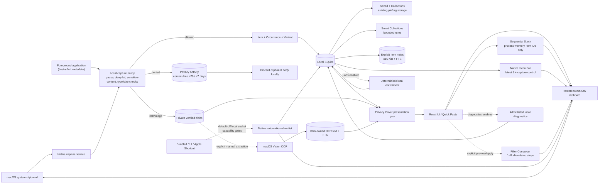
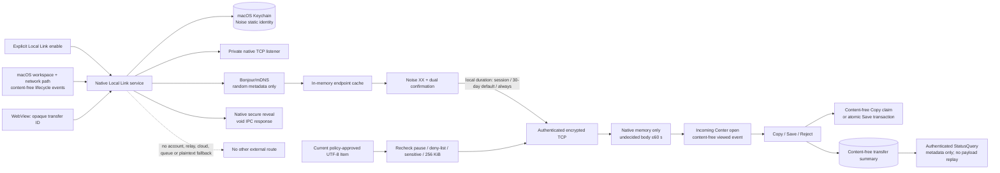

# ClipRiva data flow

- **Assessment date:** 2026-08-23
- **Scope:** ClipRiva `2.0.0-alpha.1` local product boundary, default-off Labs and automation,
  manual-only OCR and default-off Local Link Preview
- **Release status:** working candidate only; Local Link is No-Go because the same-artifact real
  two-Mac and signed-build evidence is not complete

## Core and Labs flow

Core, Saved/Collections, Smart Collections/notes, Privacy Activity, Stack, Filter Composer, local
automation, Privacy Cover, Labs, local diagnostics and any permitted macOS Vision OCR have no
ClipRiva-controlled network destination. Labs uses deterministic local processing and offline
lexical retrieval; it does not connect to a model provider. Stack is not Local Link's prohibited
offline payload queue. The automation socket is owner-only local IPC and is not a TCP listener.

## Local Link v1.5 Candidate flow

When disabled, Local Link has no listener, mDNS publish/browse runtime, peer session or remote
delivery. Explicit enable is the only action that may create the native TCP/mDNS runtime. A
transient listener/discovery failure stops the unhealthy generation, preserves the explicit enabled
preference, and follows bounded supervisor retries before reporting degraded; it does not silently
reinterpret the user’s preference as disabled.

Bonjour/mDNS is restricted to the local network. It publishes a fresh random `ll-<UUID>` instance and
host identity with only allow-listed version (`v`) and pairing-visibility (`pair`) metadata. Clipboard
body, local display name, key, persistent endpoint and account identifier are not mDNS fields. mDNS
discovery is not trust; IP/port/endpoint values are native-memory routing facts only. The only
allowed body destination is an authenticated, explicitly paired Mac on the same LAN.

## Data-flow inventory

| Flow | Data | Trigger | Local destination | External destination | Control / retention |
| --- | --- | --- | --- | --- | --- |
| Capture | Clipboard text, image, rich text or file-reference path; local item/occurrence/variant metadata | Allowed clipboard change | SQLite and private local blobs when needed | None | Pause, deny-list, sensitive-content, text-family type/size checks and retention apply before persistence. Text/code/command: 256 KiB; link: 8 KiB; colour: 1 KiB. Oversized/unsupported input yields only a content-free status. Blob publication is content-addressed and no-clobber. |
| Saved and Collections | Existing `is_pinned` fact; up to eight user-authored Collection names, each at most 24 visible characters | Explicit Save/unsave or Collection membership/rename/delete action | Existing local SQLite Item/tag rows | None | Saved protects an Item from automatic retention until removed. For schema compatibility Collections remain bounded user tags; tags never enter Local Link or diagnostics. Names can contain sensitive wording, follow the Item through Recycle Bin restore and cascade-delete with it. Removing Saved preserves membership; deleting a Collection deletes membership only. Names never enter support bundles or automatic export. |
| Smart Collections | User name plus finite kind/source/Saved/time/use/Local-Link-source filter definition; at most 20 | Explicit create/update/delete or open | Local SQLite definition rows; query runs against current History | None | Dynamic rule, not an Item snapshot. No free-text search, manual Collection membership, nesting, SQL, regex or script. Deleting a rule never deletes Items and a rule never changes retention. |
| Item notes and note search | One explicit UTF-8 note per Item, max 16 KiB; dedicated FTS terms | Explicit Inspector load/save/delete or local search | Item-owned SQLite note row and FTS index | None | Ordinary History/list DTOs exclude note bodies. Blank save deletes. Note follows recycle/restore and cascade-deletes on permanent Item deletion; it neither Saves the Item nor extends retention. Excluded from Local Link, diagnostics/export, logs and metadata-only automation. |
| Privacy Activity | Finite non-capture reason, optional source application, occurrence and expiry time | Capture policy rejects or skips a clipboard change | Local SQLite `uncaptured_clipboard_events` | None | Content-free: no body, preview, hash, Item ID, filename/path, peer or endpoint. At most 20 recent rows and at most 7 days. Clear affects Activity only. It is separate from optional diagnostics. |
| Search, display, restore, menu-bar copy and direct paste | Selected local representation and metadata | User action | Native process/UI and macOS clipboard | None | The menu bar exposes at most five current local History entries and uses the same restore path. Blob bytes are returned only after regular-file, size, metadata-identity and SHA-256 verification. Direct paste first requests Accessibility only on user action; no trust/target means clipboard restore only. |
| Sequential Stack | Ordered clipboard Item IDs, cursor, collect flag and in-flight token, maximum 20 | Explicit add/collect/reorder/activate/copy-and-advance/skip/reset | Application process memory only | None | No body or durable Stack row. Collect adds only successfully persisted, policy-approved captures. Deduplicates IDs, clears on restart, and marks deleted/recycled Items unavailable rather than substituting content. Forbidden from SQLite/WAL, file/blob, logs, diagnostics, exports and Local Link. |
| Filter Composer | Named pipeline of 1–8 allow-listed text steps, optional contextual shortcut slot 1–9, preview input/output and content-free apply outcome | Labs-enabled explicit edit, preview, shortcut or apply | Definitions and optional slot in local SQLite; preview in request memory; finite completed audit after Apply | None | Shortcut acts only on an explicitly selected text Item and not in an input, dialog or IME composition. Same bounded native evaluator for preview and apply, max 256 KiB intermediate text. Preview has no clipboard/audit/storage side effect. Apply performs one clipboard write before recording only step IDs/count/outcome; no body, preview or digest. No shell, regex, file or network step. |
| Local automation | Default-off enabled state; individually granted `history.metadata`, `history.content`, `clipboard.write`, `library.write`, `filters.run`; bounded JSON request/result | Explicit user enable/grant, then bundled CLI or Apple Shortcuts shell action while app runs | Owner-only local Unix socket and request memory; local preference rows | None | No TCP/network listener. CLI does not open SQLite. Missing capability fails closed. No delete/clear, arbitrary SQL/filesystem/shell, bulk image/blob, Direct Paste, Local Link, Stack, diagnostics export, MCP or Agent History access. Text/query input uses bounded stdin rather than process arguments. |
| Privacy Cover | Persisted local enabled preference; redacted presentation state | Explicit user setting and launch bootstrap | Preference storage plus WebView/native-window state | None | Before protected surfaces render, content is omitted from DOM and accessible names; inspectors/previews/native reveal close. Platform content protection is best-effort and is not a guarantee against all screen sharing/recording. No Screen Recording, Camera or Photos permission or process scanning. |
| Local image OCR | Image bytes already captured locally; extracted text capped at 256 KiB | Explicit manual extraction in the image Inspector | Dedicated Item-owned SQLite table and FTS index | None | macOS Vision only; no automatic extraction, new account, permission, remote model or network request. Sensitive output is rejected before persistence. Text follows image recycle/restore/permanent-delete lifecycle and is excluded from Local Link, diagnostics, support bundles and logs. Clearing OCR leaves images/History intact. |
| Workspace layout | Main-window width and height, clamped to the supported minimum | User resizes the main window | Local WebView storage | None | Restores only local geometry; it contains no clipboard, account, network or device-identity data. |
| Labs and diagnostics | Local derivative or allow-listed event/result | Feature enabled | Local SQLite | None | Both are local; diagnostics exclude body, identifier, Collection/Smart Collection/note, Privacy Activity source application, Stack ID/cursor, OCR text, Filter preview and automation request content/network data. |
| Local Link consent | `enabled`, display name and update time | User explicitly toggles Local Link | SQLite | None | New install/upgrade defaults off; UI opening is not consent. The macOS bundle declares the Local Network purpose and `_clipriva._tcp` Bonjour service so the OS can request access only at this explicit action. |
| Local Link identity | Noise private/public identity and derived fingerprint | First explicit enable; reset | macOS Keychain (`AccessibleWhenUnlockedThisDeviceOnly`, no sync) | Public identity only during authenticated pairing/session | Private key never enters SQLite, logs, diagnostics or WebView. |
| Local mDNS discovery | Random instance/host and `v`/`pair` fields; transient resolved addresses | After explicit enable | Process memory | Local-LAN mDNS multicast only | No body/name/key/persistent endpoint; unregister/clear on disable, reset and exit. |
| Pairing and trust | Noise handshake material, ephemeral values, SAS/fingerprint, peer static identity, dual confirmation and local trust-duration choice | User starts pairing and confirms a duration | Temporary native memory, then content-free peer binding after both confirm | Candidate local-LAN peer only over encrypted Noise | Cancel/error/60-second ceremony expiry creates no trust. Default verified trust expires after 30 days and requires re-pairing; explicit “always” persists the peer binding, while “this session” keeps its usable peer key only in native memory. Endpoint is never persisted. |
| Text send | One current policy-approved non-empty UTF-8 body, max 256 KiB; fresh session/transfer/nonce | Explicit Send | Zeroizing native transfer memory; content-free Transfer summary | Only explicitly paired same-LAN Mac through authenticated Noise TCP | No cloud, relay, automatic sync, offline queue or plaintext fallback; retry creates fresh material. |
| Pending receive | Trusted sender reference, opaque transfer ID, plaintext, size, state and deadline | Valid encrypted body after replay/rate/capacity checks | Native process memory only | None after receipt | Autonomous deadline clears within 60 seconds even without UI polling. Opening Incoming Center records only the finite `viewed` status/timestamp in the content-free summary; it does not return plaintext to the WebView. |
| Secure reveal | Opaque transfer ID; short-lived native zeroizing copy | Explicit reveal | Native AppKit surface | None | Tauri reply is `void`; no body, endpoint or key enters WebView. It closes on its 60-second limit and on sleep, session deactivation, disable or termination; real-macOS lifecycle behaviour remains a physical gate. |
| Receiver decision | Pending plaintext and action metadata | Explicit Copy, Save or Reject | Copy: one system-clipboard write plus content-free effect claim; Save: History and terminal summary in one SQLite transaction; Reject: neither | Receipt to authenticated peer only | Copy claims are persisted before native write and completed with terminal metadata afterward. Recovery proves the write only from the matching private pasteboard marker; otherwise it records `outcomeUnknown` and never writes again. Self-capture is suppressed. |
| Receipt / status reconciliation / summary | Opaque transfer ID, finite lifecycle (`connecting`/delivery stages/`viewed`/`reconciling`/terminal result or finite failure), derived recovery action, action and timestamps | Explicit send, receiver opens Incoming Center, terminal transition, lost receipt or restart | SQLite; UI/API list max 20; active recovery evidence until resolution; terminal max 24 hours with 60-second count-pruning grace | Authenticated peer receives content-free Receipt or v3 `StatusQuery`/`StatusResponse` only | Status responses are `unknown`, `pending` or a finite terminal receipt. No body, preview, ciphertext, digest, endpoint, key or old payload is stored or replayed. Bounded reconciliation ends as `outcomeUnknown` when no terminal result can be proved. |
| Local Link lifecycle | Sleep/wake, session active/inactive, termination, satisfied/unsatisfied network path and worker generation | macOS workspace, Network.framework or listener health callback | Native supervisor state only | None | Events contain no body, peer, endpoint, SSID or OS error. Pending body/native reveal are cleared before transport stop. Restarts use generation checks, 500 ms debounce and bounded 250 ms/1 s/2 s/5 s retries. |
| Readiness snapshot | Enabled runtime, discovery, trust and recently authenticated-presence stages; finite blocker/action | Devices view or explicit refresh | Request memory only | None | Read-only: does not start Local Link, prompt for Local Network permission or probe a body path while disabled. No endpoint, address, device label or raw OS error. |
| Local Link diagnostics bundle | App/OS architecture, readiness, per-export salted peer references, trust/availability and bounded transfer status/failure/recovery/timing metadata | Explicit Preview diagnostics, then optional Download JSON | Requesting WebView and user-selected download only | None | Built on demand; maximum 50 peer/transfer records; no automatic persistence or upload. Excludes body/preview, display name, stable IDs, fingerprint, endpoint/IP/port/SSID, path, key, nonce, digest, Item ID, byte count and raw error. |
| Replay protection | Peer reference, opaque transfer/session ID, nonce and expiry | Validated offer | SQLite, max 24 hours | None | No body, digest, endpoint or secret. |
| Rate/capacity | Per-peer/global timestamps and counters | Offer attempt | Native process memory | None | Enforced before body retention. |

## Storage and deletion matrix

| Object | Location | Maximum lifetime / deletion event | Never stored there |
| --- | --- | --- | --- |
| Clipboard blob | Owner-only app-data blob directory (`0700` directories, `0600` files on Unix/macOS) | History/Recycle Bin reference lifetime; removed after the final database reference is permanently deleted | Keychain/session secrets, arbitrary imported file contents, external scan results |
| Saved state | Existing SQLite `clipboard_items.is_pinned` | Until explicit unsave or Item permanent deletion; while Saved, automatic retention does not remove the Item | Account/cloud record, Local Link state or separate content copy |
| Collection name | SQLite `clipboard_item_tags`, attached to one Item | Same History/Recycle Bin lifetime as the Item; cascade-deleted on permanent deletion | Local Link payload/summary, diagnostics/support export, endpoint or key material |
| Smart Collection definition | SQLite smart-collection table | Until explicit rule deletion or all local app data is removed; maximum 20 | Clipboard/note body, matched-Item snapshot, SQL, regex, script, Local Link or export |
| Item note and note FTS row | Dedicated Item-owned SQLite tables | Same History/Recycle Bin lifetime as owning Item; blank save/explicit delete removes note; permanent Item deletion cascades | Ordinary list DTO, Saved/retention fact, Local Link, diagnostics/support export, logs or metadata-only automation result |
| Privacy Activity event | SQLite `uncaptured_clipboard_events` | At most 20 most recent rows and at most 7 days; explicit clear removes Activity only | Clipboard body/preview/hash, Item ID, filename/path, Collection, peer, endpoint or diagnostics |
| Stack state | Process memory | Application restart or explicit reset; at most 20 deduplicated Item IDs | SQLite/WAL, file/blob, log, diagnostics/export, Local Link or clipboard body |
| Filter preview | Native/request memory | Preview completion, replacement or dialog close; each intermediate capped at 256 KiB | SQLite audit, clipboard, logs, diagnostics, Local Link or network |
| Automation request/result | Owner-only socket/request memory | One bounded request/response while running | Durable body log, network listener, diagnostics, Local Link or remote Agent |
| Privacy Cover preference | Local preference storage | Until changed/reset by user | Clipboard/OCR/Collection/source content; permission grant or capture evidence |
| OCR text and FTS row | Dedicated Item-owned SQLite tables | Same recycle/restore/permanent-delete lifecycle as owning image; explicit clear removes derivative only | Local Link, diagnostics/support export, logs, network payload or independent orphan lifetime |
| Local identity private key | macOS Keychain | Explicit identity reset or manual Keychain removal | Clipboard body, endpoint, account credential |
| Trust binding | SQLite (except the session-only usable peer key, which stays in native memory) | Revoke/reset, 30-day expiry or explicit re-pair | Private/session key, address/port, clipboard body |
| Pairing SAS/transcript | Native memory | Completion, failure, cancel or 60-second expiry | Durable code/hash or reusable secret |
| Session keys and endpoint cache | Native/OS-networking memory | Close, disable, revoke, reset or exit | SQLite, Transfers, diagnostics, WebView |
| Pending body | Native memory | At most 60 seconds; terminal action/lifecycle clear | SQLite/WAL, file/blob, log, diagnostics, WebView |
| Transfer summary | SQLite | UI/API latest 20; active/reconciling/prepared evidence until resolution; terminal max 24 hours and protected from count pruning for the first 60 seconds | Body, preview, ciphertext, digest, endpoint, key, old-payload queue. `viewed`, `reconciling` and `outcomeUnknown` are finite metadata only. |
| Copy effect claim | SQLite, joined to one transfer | Same bounded lifetime as transfer; cascade-delete with summary | Body, preview, digest, peer, endpoint, key, History Item or replayable clipboard data |
| Replay tombstone | SQLite | Max 24 hours | Body, preview, digest, endpoint, session secret |
| Copy result and private marker | macOS clipboard | Later clipboard write / OS behaviour | History caused by the Copy itself; the random marker is not derived from the body |
| Save result | Local History | Normal History/recycle policy | System clipboard side effect |

“Memory-only” is an application serialization claim, not a claim that macOS swap, hibernation or
crash dumps can never contain process memory.

## Boundary rules

1. The WebView has named Tauri commands and UI-safe metadata only. It has no raw socket, endpoint,
   raw packet, key, trust-anchor, arbitrary SQLite/filesystem/shell access or undecided body.
2. The native Local Link service is the only owner of mDNS, listener, endpoint cache, Noise session,
   Keychain access and decrypted pending memory.
3. Explicit user enable gates native TCP/mDNS startup; disable, reset and exit must remove those
   resources and clear active/pending Local Link state. Core/Labs continue to work while Local Link
   is off.
4. The Keychain identity is `AccessibleWhenUnlockedThisDeviceOnly`, non-synchronizing and
   fail-closed. Missing identity with existing trusted peers requires explicit re-pair/reset.
5. Discovery metadata is random and minimal. A device name, mDNS record, IP/port or endpoint never
   establishes trust or becomes a persistent routing record.
6. Every body path uses authenticated Noise encryption. There is no plaintext, legacy, cloud-relay,
   Internet, account, automatic-sync or offline-queue fallback.
7. Local policy is rechecked before a body enters the transport. Local Link supports text only; rich
   text, images, file bytes and a database/history export are out of scope.
8. Incoming Center may record an idempotent, content-free `viewed` transition without revealing the
   body. Copy uses a durable content-free claim and pasteboard marker; Save commits History and its
   terminal result atomically. Cancel, timeout, disable, revoke, disconnect and exit clear undecided
   body; duplicate/replayed traffic and restart recovery cannot create a second side effect.
9. Transfer/diagnostic schemas are content-free. They prohibit body, preview, ciphertext, digest,
   endpoint, device identity, Collection/Smart Collection/note content, Privacy Activity source
   application, Stack state, Filter preview, automation body, OCR text and key material.
   The user-requested Local Link support bundle is an ephemeral allow-list projection with at most
   50 records and a new salted peer reference per export; ClipRiva neither persists nor uploads it.
10. Native adapters now observe sleep/wake, session active/inactive, termination and network path;
    callbacks are generation-scoped and transport recovery is bounded. Real-Mac lock/user-switch,
    already-visible native-view closure, sleep/wake and Wi-Fi switching remain acceptance evidence,
    not claims established by reducer/loopback tests. Any later notification capability requires a
    separate privacy/permission implementation and test update.
11. Blob storage keys are canonical SHA-256 identifiers, not user paths. Symlinks, non-regular
    files, oversized content, file-identity changes and digest mismatches fail closed before
    clipboard restore. Permission and integrity checks do not constitute encryption at rest.
12. New installs use a 30-day unsaved History default. Retention cleanup is local and automatic;
    Saved records use the existing pin exemption. Existing user-selected retention values are
    preserved.
13. Saved/Collections are product terms over existing local pin/tag facts. Collection names are
    sensitive user metadata and cannot cross Local Link, diagnostics or automatic-export schemas.
14. Privacy Activity is a content-free local audit of rejected/skipped captures, not reliability
    diagnostics. It is capped at 20 rows and 7 days, and clearing it cannot mutate another store.
15. Sequential Stack contains only bounded Item IDs, a cursor, collect flag and in-flight token in
    process memory. Restart clears it; Local Link Transfers remain metadata summaries and never
    become a body queue.
16. Privacy Cover's guarantee is omission/redaction from DOM and accessible names plus immediate
    surface closure. Platform content protection is best-effort only; no global capture-blocking,
    meeting-app detection or Screen Recording permission is claimed.
17. Notes are explicit, bounded History content and must stay out of ordinary list DTOs. Smart
    Collections are bounded rule definitions, never snapshots, and neither feature changes Saved or
    retention semantics.
18. Filter Composer accepts only a finite local step allow-list. Executing a Filter presents a
    process-memory Before/After preview without a clipboard or audit write. Explicit confirmation
    rechecks the Item version/content, rule and result; a canceled or stale preview has no effect.
    A successful confirmation writes the system clipboard once, then records content-free completion
    metadata. If the audit fails after the write, the UI reports that copy succeeded and audit failed
    rather than inviting a blind retry.
19. Automation is disabled by default, uses an owner-only local Unix socket, and checks each finite
    capability at execution time. The bundled CLI never opens the database and exposes no arbitrary
    command, deletion, export, networking or Agent/MCP surface.
20. macOS Vision is the only OCR extraction engine in this boundary. Extraction is manual-only;
    dedicated text/FTS rows are Item-owned, sensitive-checked and excluded from
    network, Local Link, diagnostics, support bundles and logs. Quick Paste may return an Item
    matched by manual OCR or a Note, but its compact result carries field provenance, not either
    auxiliary text body.

## Evidence and review triggers

Local Link remains Preview / No-Go. The required same-artifact external evidence is currently
**not satisfied**: at least **50 authenticated pairings** and **200 real text transfers**, plus
Copy/Save/Reject idempotency, cancellation, timeout, revocation, replay, lock/user-switch,
Wi-Fi/AP isolation, sleep/wake, performance, packet inspection, SQLite/WAL/blob/log scans,
Keychain lifecycle and signed/notarized clean-machine installation. Automated tests, fixtures,
loopback and same-host processes do not constitute that evidence. The evidence ledger and decision
rules are in
[`docs/release/local-link-ga-evidence-gate.md`](../release/local-link-ga-evidence-gate.md).

Update this document, [PRIVACY.md](../../PRIVACY.md) and
[docs/open-source/module-boundary.md](../open-source/module-boundary.md) in the same task before
changing a network path, discovery field, account, telemetry/error reporting, export, stored type,
key lifecycle, permission, protocol, fallback or retention/deletion behaviour. The 2.0 product
acceptance cases are maintained in
[`docs/testing/clipriva-2.0-acceptance.md`](../testing/clipriva-2.0-acceptance.md).

The cross-repository security assumptions and test/gate mapping are in
[`docs/security/THREAT_MODEL.md`](../security/THREAT_MODEL.md).
