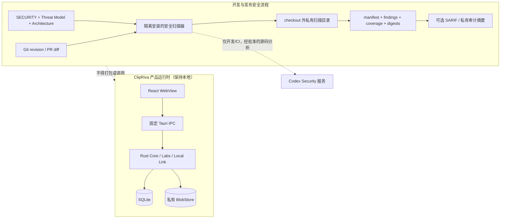

# ClipRiva 代码安全能力落地方案

- **状态：** M1/M2 已于 2026-07-29 实现并通过仓库验证；M3–M5 待维护者授权
- **编写日期：** 2026-07-29
- **适用阶段：** v1 首次公开发布前，以及未来 Local Link 真实网络适配器启用前
- **评估基线：** ClipRiva `7457b61`；`openai/codex-security` `f22d4a36f26d16287bcdfd707b369116e02a08c3`

## 1. 结论与范围

ClipRiva 应吸收 Codex Security 的两类能力：

1. **应用自身的本地安全加固：** 私有目录权限、内容寻址 Blob 的完整性校验、
   符号链接和文件替换防护、失败关闭。
2. **开发与发布安全流程：** 仓库级威胁模型、完整扫描和差异扫描、结构化覆盖制品、
   漏洞验证、攻击路径、跨扫描追踪和分阶段门禁。

Codex Security 不应成为 ClipRiva 桌面应用的运行时依赖。扫描器只允许存在于开发、CI
或发布审计环境中，不得让 Core、Labs 或 Local Link 因此获得 OpenAI 账号、API、网络、
遥测或模型依赖。

本方案推荐落地：

- 新增覆盖整个 ClipRiva 仓库的威胁模型；
- 加固 `BlobStore` 的权限、读取、复用和原子写入；
- 为安全扫描建立私有、可校验、可追踪的制品契约；
- 先在冻结的 release candidate 上进行人工触发的完整扫描；
- 验证稳定后，再增加独立、最小权限的 pull request 差异扫描；
- 先报告、后门禁，最终仅对已完成扫描中的 High/Critical 漏洞阻断；
- 对 finding 进行验证、修复和复测，不把“本次未再次发现”当作“已经修复”。

本方案暂不落地：

- 把 `@openai/codex-security` 加入 ClipRiva 的 `dependencies` 或桌面二进制；
- 强制所有开发者使用联网的 pre-commit 扫描；
- 为单仓库引入 bulk-scan、常驻扫描服务、MCP 或扫描管理后台；
- 复制 Codex Security 的完整 Python workbench；
- 未经维护者批准，将源码或安全制品发送到任何外部服务。

## 2. 当前基础与主要缺口

ClipRiva 已经具备较好的安全基础：

- `SECURITY.md` 明确了 Core、WebView、Accessibility、Labs 和 Local Link 的信任边界；
- Tauri WebView 使用固定命令集合，没有任意 SQL、路径、Shell、Socket 或 Keychain IPC；
- 捕获和 Local Link 发送前执行 deny-list 与敏感内容策略；
- Local Link 默认关闭，当前生产适配器失败关闭；
- CI 固定 GitHub Actions commit，执行 TypeScript/Rust lint、测试和构建；
- 已有依赖、许可证、敏感信息、静态分析和公开发布审计文档。

当前主要缺口：

1. 正式威胁模型集中在 Local Link，没有一个统一覆盖 Clipboard、WebView IPC、SQLite、
   Blob、Quick Paste、Accessibility 和 Labs 的仓库级模型。
2. `BlobStore` 会验证 storage key 的格式，但读取已有文件时没有重新计算 SHA-256；已有
   路径如果被替换、损坏或指向符号链接，当前实现缺少完整性失败关闭证明。
3. 应用数据和 Blob 文件主要依赖系统 umask，没有由代码和测试明确保证私有权限。
4. CI 没有代码安全扫描；发布清单要求漏洞扫描，但没有定义工具、覆盖完整性、结果制品、
   退出语义和 finding 处置流程。
5. 当前审计报告是人工 Markdown 快照，没有机器可验证的 target、coverage、findings、
   artifact digest 和扫描完整性契约。

## 3. 设计原则

### 3.1 本地优先边界不变

扫描器属于仓库维护工具，不属于 ClipRiva 产品。桌面应用不得包含扫描凭据、扫描 SDK、
扫描 endpoint 或运行时开关。应用构建完成后应能在没有 Codex Security、Python、OpenAI
账号或网络的环境中运行全部 Core 功能。

### 3.2 完整性优先于“无发现”

只有目标身份明确、扫描完成、coverage 完整、制品通过校验时，“没有 finding”才有意义。
取消、超时、成本上限中止、工具错误、覆盖不完整或制品缺失必须显示为 incomplete/error，
不得作为通过结果。

### 3.3 安全制品默认敏感

扫描报告可能包含源码片段、攻击路径、PoC、漏洞位置和修复建议。原始制品必须放在仓库
checkout 之外的私有目录，限制读取者和保留期，不得直接提交到 Git，也不得粘贴到公开
Issue、PR 评论或发布说明。

### 3.4 外部工具采用最小权限

CI 中扫描凭据只暴露给扫描进程。扫描器在 checkout 之外安装并通过绝对路径调用；checkout
不保留 GitHub 凭据；fork 和 Dependabot PR 不接收扫描 secret；GitHub Actions 使用 commit
固定版本。

### 3.5 先验证再门禁

初期只报告 finding，收集完整率、运行时间、成本和误报数据。门禁启用前必须建立 finding
验证和 false-positive 复核流程。报告模式不阻断真实 finding，但扫描器错误和覆盖不完整仍
必须可见，不能静默成功。

## 4. 目标结构



## 5. 工作包 A：仓库级威胁模型

### 5.1 文件与职责

新增 `docs/security/THREAT_MODEL.md`，作为整个仓库的安全分析入口；保留
`docs/local-link/THREAT_MODEL.md` 作为网络子系统的详细模型。随后更新：

- `SECURITY.md`：链接仓库级模型并定义安全扫描政策；
- `docs/architecture.md`：标出仓库级威胁模型与各子模型的关系；
- `docs/release/release-checklist.md`：要求冻结版本使用同一模型进行扫描；
- `docs/testing/test-inventory.md`：列出边界测试与威胁的映射。

### 5.2 模型必须覆盖

1. **受保护资产**
   - 原始剪贴板文本、图片、富文本和文件引用；
   - History、Recycle Bin、搜索索引和派生 enrichment；
   - Blob 文件、SQLite、设置和本地诊断；
   - Accessibility 权限与前台应用焦点；
   - Local Link 长期身份、peer binding、临时明文和协议状态；
   - 发布凭据、扫描凭据和安全制品。
2. **攻击者和前置条件**
   - 恶意网页或应用向系统剪贴板写入构造内容；
   - 被攻陷或恶意的 WebView 内容；
   - 能调用公开 Tauri command 的前端代码；
   - 本地同一用户下能篡改应用数据的进程；
   - Local Link 启用后的被动/主动网络攻击者和恶意 peer；
   - 恶意仓库内容、构建脚本、PR 和 prompt-like 文本；
   - 误配置的 CI、泄露的 token 或过度公开的扫描制品。
3. **信任边界**
   - macOS Pasteboard → native capture；
   - WebView → Tauri IPC → native privileged operation；
   - native process → SQLite/Blob/Keychain；
   - Quick Paste → Accessibility/目标应用；
   - Local Link → Bonjour/TCP/Noise/peer；
   - GitHub runner → checkout → scanner → external service → artifact store。
4. **必须保持的安全不变量**
   - 未通过捕获策略的内容不得持久化或发送；
   - WebView 不获得任意路径、SQL、Socket、Keychain 或 Shell 权限；
   - Blob storage key 不能逃逸根目录，读取内容必须匹配内容哈希；
   - restore/direct paste 不得绕过权限、焦点和失败回退；
   - Local Link 未经明确同意不得监听、发现、配对或传输；
   - Keychain 私钥、临时明文和扫描 secret 不进入日志、IPC、SQLite 或公开制品；
   - incomplete 扫描不得被解释为无漏洞。
5. **不在模型中夸大的保证**
   - 不把同一 macOS 用户下的完全主机控制描述为可彻底防御；
   - 不把 loopback、浏览器测试或静态审查描述为真实两机认证证据；
   - 不把 AI 扫描当作形式化证明或依赖漏洞扫描、secret scan 的替代品。

### 5.3 版本策略

仓库内模型记录 `Last reviewed`，不要求每个 commit 都修改正文。每次扫描的私有 manifest
记录精确 commit SHA、模型文件 digest 和工具版本，从而证明某次结果使用了哪份模型。
产品边界、权限、存储类型或网络行为变化时，必须在同一变更中更新模型。

### 5.4 验收标准

- 所有主要运行时 surface 都映射到资产、输入、边界和不变量；
- Local Link 子模型与仓库级模型没有相反假设；
- `SECURITY.md` 和 release checklist 能找到规范模型；
- 每个高风险不变量至少对应一个自动化测试、人工 gate 或明确的待补证据；
- 模型不包含真实 endpoint、凭据、用户数据、私有路径或密钥材料。

## 6. 工作包 B：BlobStore 与私有文件权限加固

### 6.1 威胁与目标

`BlobStore` 已使用 `sha256/<prefix>/<hash>` 的受限 storage key，但内容寻址只有在读取时
验证内容仍等于 key 中的 hash，才能提供完整性保证。目标是让损坏、符号链接、替换、超大
文件或竞争写入都失败关闭，并避免向 WebView 或日志泄露实际路径和可疑内容。

此工作包主要防止本地数据损坏、意外替换和低权限本地篡改造成错误恢复。它不声称能抵御
已经完全控制当前用户账户或 ClipRiva 进程的攻击者。

### 6.2 推荐实现

在 `src-tauri/src/media/mod.rs` 中引入内部文件检查层，不向 WebView 暴露新 command：

1. **私有根目录**
   - 创建应用数据目录、`blobs`、`sha256` 和 hash 分片目录后，在 macOS/Unix 上确保目录
     mode 为 `0700`；
   - 使用 `symlink_metadata` 拒绝 Blob 根目录自身是符号链接或非目录；
   - canonicalize 后保存稳定根路径；所有派生路径继续只由已验证 hash 构造；
   - 不递归修改 Application Support 的父目录权限。
2. **私有文件**
   - 临时 Blob 以 `create_new` 创建，并在 macOS/Unix 上显式设置 `0600`；
   - SQLite 文件权限是否一并收紧，需先在干净安装、升级和备份恢复场景验证；若执行，
     必须与 Blob 权限作为一个独立、可回滚的迁移任务处理。
3. **安全读取**
   - 从 storage key 得到期望 SHA-256；
   - `symlink_metadata` 要求目标是普通文件且不是 symlink；
   - 打开文件后比较打开前路径 metadata 与文件描述符 metadata 的 device/inode；不一致时
     失败，防止常见的检查后替换；
   - 在分配和读取前检查文件长度，最多读取 `MAX_AUTOMATIC_BLOB_BYTES + 1`；
   - 计算实际 SHA-256，并与 storage key 中的 hash 比较；不匹配时返回新的有限错误类型，
     不返回字节，不打印路径或内容；
   - 使用已打开的文件描述符读取，不在校验后重新按路径打开。
4. **安全复用**
   - `store` 遇到目的文件已存在时，不能只依赖 `path.exists()`；必须走同一套普通文件、
     metadata、大小和 hash 校验；
   - 已存在但损坏或类型不正确时失败，不自动覆盖，以便避免把本地异常静默掩盖为成功。
5. **无覆盖原子写入**
   - 写临时文件、`sync_all` 后，优先用同文件系统 `hard_link(temp, destination)` 实现
     原子 no-clobber；成功后删除临时名字；
   - 若 destination 已存在，删除临时文件并验证已有 Blob；
   - 其他错误清理临时文件并失败；
   - 评估是否需要同步父目录以满足崩溃一致性；若平台行为不可靠，保留当前 rename 路径
     作为明确记录的兼容分支，但不得覆盖未经验证的已有目标。
6. **有限错误契约**
   - 增加类似 `UnexpectedFileType`、`IntegrityMismatch`、`UnsafeMetadataChange` 的内部错误；
   - IPC 最终只返回安全、宽泛的恢复失败信息；日志不得包含原始内容、用户文件路径或
     Blob 的绝对根目录。

如果评审认为必须抵御更强的同用户并发文件系统攻击，再单独评估基于 directory fd、
`openat` 和 no-follow flag 的实现。该增强可能需要新增直接 Rust 依赖或平台 FFI，不应在
没有 threat-model 决策、依赖审计和专门测试时顺带加入。

### 6.3 测试矩阵

在现有 Rust 测试中增加：

| 场景 | 预期 |
| --- | --- |
| 正常 Blob 写入、读取、重复写入 | 内容一致；重复写不覆盖；hash 匹配 |
| storage key 包含绝对路径、`..`、反斜杠或非 SHA-256 | 在路径访问前拒绝 |
| destination 是 symlink | store/read 都失败，不读取目标，不覆盖目标 |
| destination 是目录、FIFO 或其他非普通文件 | 失败关闭 |
| 已有 Blob 被修改一个字节 | read/复用返回 integrity error，不恢复到剪贴板 |
| 已有 Blob 超过上限 | 有界失败，不无界分配 |
| metadata 与打开后的 device/inode 不一致 | 失败关闭 |
| 两个线程同时写同一内容 | 最终只有一个有效 Blob，双方得到一致结果或安全重试结果 |
| 写入中途失败 | 临时文件得到清理；旧有效 Blob 不受影响 |
| macOS 新建目录和文件 | 目录 `0700`，文件 `0600` |
| 从已有安装升级 | 历史 Blob 可读；异常权限有明确修复或提示策略 |

测试必须使用 `tempfile` 风格的唯一临时目录或当前 UUID 方式，目标路径需要精确验证后才能
清理。若为测试引入新 crate，同样触发依赖与许可证复核；优先复用现有标准库测试工具。

### 6.4 文档与边界跟进

此变更不新增网络、账号、权限或存储类型，但改变本地文件权限和损坏处理语义。应更新：

- `docs/architecture.md` 的 BlobStore 不变量；
- `PRIVACY.md` 和 `docs/privacy/data-flow.md` 中对本地表示文件的权限/完整性描述；
- `docs/testing/test-inventory.md`；
- release checklist 的实际 App 数据目录权限和损坏 Blob 验证项。

## 7. 工作包 C：安全扫描制品契约

### 7.1 原始制品位置

- 本地运行：使用 `mktemp -d` 创建仓库之外的目录；
- CI：使用 `$RUNNER_TEMP`，不得使用 checkout 下的 `security-results/`；
- macOS/Linux 已存在的结果目录必须只允许当前用户访问；
- 原始结果默认保留不超过 7 天；release owner 可在受控私有存储中延长保留；
- `.gitignore` 仍需覆盖常见扫描结果名，但 `.gitignore` 不是允许把结果先写入仓库的理由。

### 7.2 每次扫描的最小证据

应保存或从工具结果中读取：

- target kind、repository identity、精确 revision/base/head 或 working-tree snapshot digest；
- scanner/package/plugin/model 版本和扫描模式；
- 开始、结束、完成状态和中止原因；
- include/exclude scope 与 knowledge-base 文件 digest；
- `scan-manifest.json`；
- `findings.json`；
- `coverage.json`；
- 每个被列为 artifact 的文件 SHA-256；
- 可选 `report.md` 和 SARIF；
- 命令退出码、coverage completeness、finding 数量和最高 severity；
- 已执行/跳过的动态验证以及剩余 proof gap。

优先直接消费 Codex Security 生成并校验过的契约，不在 ClipRiva 仓库复制其整套脚本或 schema。
若未来决定复制或改造 schema/代码，必须记录来源 commit、Apache-2.0 许可证和修改内容，并
更新 `THIRD_PARTY_NOTICES.md`。

### 7.3 结果判定

| 状态 | 合并/发布含义 |
| --- | --- |
| 完整扫描，无达到门禁级别的 finding | 可通过代码扫描这一项，仍需其他 release gate |
| 完整扫描，有未处置 High/Critical finding | 门禁阶段阻断；报告阶段必须创建私有处置记录 |
| finding 已标为 false positive | 必须保存具体原因；后续扫描重新验证原因是否仍成立 |
| finding 未再次出现但后续 coverage 不完整或未覆盖原位置 | `unknown`，不得标记 resolved |
| 扫描取消、超时、成本中止、工具错误、制品/coverage 不完整 | incomplete/error，不得作为通过 |
| 修复后通过真实边界的复现或针对性测试 | 可标记 resolved，并保留验证命令和证据摘要 |

### 7.4 可提交的审计摘要

原始 finding 不提交到仓库。冻结 release candidate 可更新
`docs/audit/codex-security-scan-report.md`，但只记录：

- 扫描日期、target commit、工具版本和模式；
- scope 和 knowledge-base 清单；
- completeness；
- 按 severity 和处置状态聚合的数量；
- release blocker 是否清零；
- 原始制品存放位置的抽象描述和保留期，不写本机绝对路径；
- 执行过的验证、跳过项和剩余风险；
- 不包含未修复漏洞细节、PoC、源码片段、token、内部 endpoint 或用户数据。

## 8. 工作包 D：冻结版本的完整扫描

### 8.1 启用前置条件

- 维护者确认有权将该仓库源码交给所选 Codex Security 账号/服务分析；
- CLI/SDK beta 访问已开通；
- 扫描凭据位于批准的 secret manager 或当前 shell，不写 `.env`、脚本、文档或命令历史；
- 结果目录、读取者和保留期已确定；
- 当前 release candidate commit 已冻结；
- 依赖漏洞扫描、secret scan 和普通 CI 仍单独执行。

### 8.2 推荐步骤

1. 在干净 checkout 上运行现有 `pnpm release:verify`；
2. 先运行 dry-run，确认 target、scope、输出目录和配置，不加载扫描凭据；
3. 运行标准全仓扫描，knowledge base 至少包括：
   - `SECURITY.md`；
   - `docs/security/THREAT_MODEL.md`；
   - `docs/architecture.md`；
   - `docs/privacy/data-flow.md`；
   - `docs/local-link/PROTOCOL.md`；
   - `docs/local-link/THREAT_MODEL.md`；
4. 结果写入 checkout 外的私有临时目录；
5. 校验 manifest、findings、coverage、artifact digests 和退出状态；
6. 对 reportable finding 逐项执行验证，不直接批量修复；
7. 维护者批准后实施最小修复和回归测试；
8. 对当前 checkout 复扫或用 `validate` 验证已接受 finding；
9. 生成可提交的脱敏审计摘要；
10. 任意修复、依赖、权限、隐私或协议变化后重新冻结 commit，并重新执行受影响 gate。

示意命令只表达边界，不固定未获批准的包来源或成本值：

```bash
SECURITY_SCAN_ROOT="$(mktemp -d)"
codex-security scan . \
  --mode standard \
  --knowledge-base SECURITY.md \
  --knowledge-base docs/security/THREAT_MODEL.md \
  --knowledge-base docs/architecture.md \
  --knowledge-base docs/privacy/data-flow.md \
  --knowledge-base docs/local-link/PROTOCOL.md \
  --knowledge-base docs/local-link/THREAT_MODEL.md \
  --output-dir "$SECURITY_SCAN_ROOT/results" \
  --json > "$SECURITY_SCAN_ROOT/result.json"
```

实际自动化脚本不得把 `SECURITY_SCAN_ROOT`、API key 或结果目录写入仓库。若脚本需要清理，
必须验证目标是本次创建的精确临时目录，禁止对未解析变量、工作区根目录或用户目录执行递归删除。

### 8.3 Deep scan 触发条件

以下任一情况在发布前触发 deep scan，而不是每个普通 PR 都运行：

- Local Link 的生产 listener、Bonjour browse/register 或真实 peer session 首次启用；
- 新增远程模型、账号、同步、导出、遥测或错误报告边界；
- 新增任意文件导入/解压/插件/脚本执行能力；
- 发生 Critical/High 漏洞并怀疑同类控制在多个模块重复失效；
- 首次公开稳定版冻结，且成本、权限与运行时间已经获批。

## 9. 工作包 E：Pull Request 差异扫描

### 9.1 部署阶段

#### 阶段 E0：人工试运行

- 对若干代表性分支使用 `--diff <base> --head <head>`；
- 覆盖至少 Rust native、React/Tauri IPC、Blob/SQLite 和 Local Link 变更；
- 记录完整率、运行时、成本、有效 finding、误报和修复验证质量；
- 不修改 branch protection。

#### 阶段 E1：CI 报告模式

- 新增独立 `.github/workflows/codex-security.yml`，不把 secret 加入现有 build/test job；
- 不传 `--fail-on-severity`，因此完整扫描中的 finding 仅报告；
- 工具错误和 incomplete 必须让 job 非成功或明确显示为未完成；
- SARIF 和原始 artifact 仅对授权仓库成员可见，保留期默认 7 天。

#### 阶段 E2：High/Critical 门禁

满足以下条件后，由维护者单独批准：

- 至少 10 个代表性、同仓库非 fork PR 完成试运行；
- 所有试运行均能区分 complete、finding gate 和 incomplete/tool error；
- 所有 finding 已完成人工验证或记录具体 false-positive 原因；
- 运行时间 P95 不超过维护者接受的 PR 检查预算；
- 单次和月度成本上限已获批准并可观测；
- artifact 的可见性、保留期和删除方式已验证；
- branch protection 能区分安全 finding 与工具不可用，不产生静默放行。

门禁初始阈值推荐为 `high`。是否包含 `medium` 应根据实际噪声、风险和维护能力另行决策，
不能只为了更严格而降低阈值。

### 9.2 CI 安全结构

Workflow 必须满足：

1. 仅处理同一仓库内的 PR，跳过 fork 和 `dependabot[bot]`；
2. 在 checkout 之前把批准版本的 scanner 安装到 `$RUNNER_TEMP/codex-security`；
3. 安装使用批准、可复现的包来源，并使用 `--ignore-scripts --no-audit --no-fund`；
4. scanner 通过 `$RUNNER_TEMP/.../codex-security` 绝对路径调用；
5. checkout 精确 PR head，`fetch-depth: 0`，`persist-credentials: false`；
6. 用 base/head SHA 计算 merge-base，不信任 PR 标题或正文提供的 revision；
7. `CODEX_API_KEY` 只存在于 scan step 的 `env`；
8. 不把 GitHub token、API key、整个 environment 或 command trace 写入日志；
9. 结果写 `$RUNNER_TEMP`；只在 sealed manifest 存在时导出 SARIF；
10. GitHub Actions 依赖使用完整 commit SHA 固定；
11. 权限默认为 `actions: read`、`contents: read`；仅上传 SARIF 时增加
    `security-events: write`；
12. `if: always()` 的 artifact 步骤不得把不存在或未校验的结果误称为完成扫描；
13. 设置 workflow timeout 和经批准的扫描成本上限；成本中止归类为 incomplete。

### 9.3 供应链注意事项

扫描 PR 意味着 scanner 会读取不可信仓库内容。因此：

- 不从 checkout 中解析 scanner executable；
- 不让仓库内 `node_modules/.bin`、脚本或相对 `PATH` 项覆盖 scanner；
- 不在携带扫描 secret 的步骤执行 `pnpm install`、Cargo build 或仓库脚本；
- scanner 如需运行验证命令，应依赖其沙箱和审批政策，禁止直接继承高权限环境；
- checkout 中的 Markdown、代码注释和 finding 文本一律作为不可信数据，不作为 CI 指令。

## 10. 工作包 F：Finding 生命周期与修复验证

### 10.1 状态

每个 finding 使用稳定标识和以下状态：

- `new`：当前扫描首次出现；
- `persisting`：与历史 finding 属于同一根因且仍存在；
- `reopened`：曾验证修复，当前再次出现；
- `resolved`：当前代码经过针对性验证，原攻击路径不再成立；
- `false_positive`：有具体、当前仍成立的反证；
- `deferred`：证据或产品决策不足，不能确认或排除；
- `unknown`：后续扫描未覆盖原位置、coverage 不完整或匹配不确定。

### 10.2 验证顺序

1. 明确攻击者输入、入口、最近控制点、sink/破坏的不变量和前置条件；
2. 寻找最强反证，避免只寻找支持 finding 的证据；
3. 优先通过真实接口或现有测试 harness 复现；
4. 无法动态复现时，记录静态 source → control → sink 路径和 proof gap；
5. 修复前尽可能增加会失败的最小回归测试；
6. 实施最小、仓库原生的修复，不弱化其他边界；
7. 按“原问题不再复现 → 合法行为仍正常 → 相关测试 → 完整检查”的顺序验证；
8. 记录精确命令、结果和跳过项；相关验证不可用时不得标记 fixed/resolved。

### 10.3 私密追踪

未修复漏洞和 PoC 优先放在 GitHub Private Security Advisory 或其他经维护者批准的私有
tracking destination。不得因为公开 Issue 更方便而降级披露渠道。公开 PR 只能包含安全的
修复说明；需要隐藏的攻击细节在修复和协调披露后再决定是否公开。

## 11. 仓库规则触发与文档同步

### 11.1 引入 CI 扫描时

虽然扫描器不是产品运行时，新增外部网络请求、API secret 和 CI 配置仍触发仓库规则。
同一任务至少更新：

- `PRIVACY.md`：明确 Codex Security 是维护者选择的开发/发布工具，不随 App 分发，不处理
  用户剪贴板数据库；
- `docs/privacy/data-flow.md`：单独画出“源码 checkout → scanner → 外部服务 → 私有制品”
  的开发工具数据流，与产品数据流隔离；
- `docs/open-source/module-boundary.md`：把扫描服务归为开发/发布外部边界；
- `SECURITY.md`：原始 finding 和扫描制品的私密处理政策；
- `docs/development/environment-variables.md`：只记录变量名、用途和 secret manager 要求，
  不提供真实值；
- `.github/PULL_REQUEST_TEMPLATE.md`：如有需要，增加安全扫描状态/跳过原因，而不是粘贴报告；
- 边界测试：证明桌面 bundle 和 runtime 依赖中没有 Codex Security、API key、endpoint 或
  扫描命令。

### 11.2 依赖与许可证

推荐将 scanner 安装在 CI 临时目录，而不是修改 ClipRiva `package.json`。如果后续仍决定
新增 `@openai/codex-security` 直接开发依赖，则必须在同一变更中：

- 更新 `docs/audit/dependency-inventory.md`；
- 重新执行 `docs/audit/sbom-license-review.md` 中的 Node 和 Rust 审查；
- 记录 Apache-2.0 许可证、缺失 metadata 和限制性许可证检查结果；
- 评估锁文件增长、安装脚本、transitive binary 和发布 bundle 是否被污染；
- 用测试证明该依赖不进入生产 frontend/native bundle。

复制 Codex Security 的代码、schema 或其他材料时，按第三方材料处理，记录来源、commit、
许可证和修改，并更新 `THIRD_PARTY_NOTICES.md`。仅参考设计思想、调用外部 CLI 或链接文档
不等同于复制源码，但仍需在审计文档中记录工具名称和版本。

## 12. 实施顺序与可拆分任务

本轮实施记录：

- 已基于当前 v1.0 代码完成 M1/M2，不新增 Node/Rust 依赖；
- Rust 122 项通过、1 项既有 release-mode 性能基准按原设计忽略；前端 115 项、lint、
  typecheck、build、Clippy 和 `pnpm release:verify` 通过；
- 外部 Codex Security 扫描、CI secret、原始制品和 branch protection 未启用，因为 M0
  的源码处理授权、账号、读者、保留期和成本决策尚未提供；
- 更强的 directory-fd/`openat`/no-follow 实现与 SQLite 文件 mode 迁移仍是独立评审项。

### M0：决策和访问准备

- [ ] 维护者确认 Codex Security beta 访问和允许分析本仓库源码的账号/组织；
- [ ] 决定结果可见者、默认 7 天保留期、成本预算和 GitHub Code Security 可用性；
- [ ] 明确同用户本地数据篡改是否进入仓库级 threat model；
- [ ] 不修改产品代码或 CI secret。

### M1：仓库级模型与规则

- [x] 新增 `docs/security/THREAT_MODEL.md`；
- [x] 更新 `SECURITY.md`、architecture、test inventory 和 release checklist；
- [x] 为主要不变量建立测试/gate 映射；
- [x] 运行 Markdown/link 和现有相关检查。

### M2：BlobStore 加固

- [x] 实现私有目录/文件 mode；
- [x] 实现 regular-file、metadata identity、大小和 hash 校验；
- [x] 实现 no-clobber 原子写入/已有目标验证；
- [x] 添加损坏、symlink、并发、权限和升级测试；
- [x] 更新 privacy/data-flow/architecture/release 文档；
- [x] 运行 rustfmt、Clippy、Rust tests、前端边界测试和 release verification 中相关部分。

### M3：人工 RC 扫描试点

- [ ] 在 checkout 外安装和运行批准版本的 scanner；
- [ ] 对冻结 commit 进行 dry-run 和 standard 全仓扫描；
- [ ] 校验 manifest/findings/coverage/digests；
- [ ] 私密处置 finding；
- [ ] 新增脱敏 `docs/audit/codex-security-scan-report.md`；
- [ ] 不改变 branch protection。

### M4：PR CI 报告模式

- [ ] 新增独立最小权限 workflow；
- [ ] 更新隐私、数据流、模块边界、环境变量和安全政策；
- [ ] 验证 fork、Dependabot、secret scope、绝对 scanner 路径和 artifact retention；
- [ ] 对至少 10 个代表性 PR 收集质量、时间、成本和误报数据；
- [ ] incomplete 不得静默成功。

### M5：High/Critical 门禁

- [ ] 维护者审查 M4 证据并单独批准；
- [ ] 设置 `--fail-on-severity high` 或等效策略；
- [ ] 更新 branch protection 和故障处置 runbook；
- [ ] 演练真实 High finding、false positive、工具超时和服务不可用；
- [ ] 证明关闭该 workflow 不影响产品构建和本地运行。

### M6：真实网络边界前 deep scan

- [ ] Local Link 生产网络启用前冻结精确候选 SHA；
- [ ] 完成 deep scan、协议/Keychain/Bonjour/Noise 专项验证和两台真实 Mac gate；
- [ ] 逐 finding 验证和复测；
- [ ] final feature merge 后重新审计；
- [ ] 只有所有产品与发布 gate 同时通过，才允许提升成熟度标签。

## 13. 总体验收标准

方案全部落地后，应满足：

1. ClipRiva App bundle、Node production graph 和 Rust runtime 不包含 Codex Security 扫描器、
   凭据或外部扫描 endpoint。
2. 仓库级威胁模型覆盖所有主要资产、攻击者、输入、信任边界和安全不变量。
3. Blob 被损坏、替换、设为 symlink、改成非普通文件或超出上限时，恢复路径失败关闭且不
   输出内容或绝对路径。
4. 新建私有数据目录和 Blob 在 macOS 上有明确、经过测试的权限。
5. 每次安全扫描都能证明 target、scope、版本、coverage、findings 和 artifact integrity。
6. incomplete/error 与“完整扫描且无阻断 finding”在 CI 和审计中不可混淆。
7. PR 扫描 secret 不会进入 fork、Dependabot、checkout Git 配置、仓库脚本或 artifact。
8. raw finding、PoC 和源码片段不会被提交到仓库或公开 tracking destination。
9. false positive 有可复核原因；resolved 有当前代码上的验证证据。
10. Codex Security 不替代 gitleaks/trufflehog、依赖漏洞扫描、Clippy/Biome、普通测试、
    签名/公证、真实 macOS 验证或 Local Link 两机 gate。

## 14. 风险、回滚与待决策项

| 风险 | 控制 | 回滚 |
| --- | --- | --- |
| 私有源码发送到未批准服务 | M0 明确授权；scanner 仅维护工具；最小账号权限 | 禁用扫描 workflow，删除 secret，按保留策略删除制品 |
| API key 被恶意 PR/脚本读取 | checkout 前隔离安装、绝对路径、同仓库 PR、scan-step-only env | 立即禁用 workflow并轮换 key；不把 key 注入其他 job |
| 扫描报告暴露漏洞或源码 | checkout 外私有目录、短保留、私有 advisory | 删除外发制品并按 `SECURITY.md` 处理披露 |
| AI 扫描误报导致开发阻塞 | 报告期、验证、false-positive 原因复核 | 暂停 required check，保留人工 RC gate |
| 扫描波动造成“假修复” | coverage/target identity、跨扫描匹配、当前代码验证 | 状态退回 unknown/deferred，不宣称 resolved |
| 成本或运行时间失控 | timeout、批准的 cost limit、仅差异扫描、deep scan 限定触发 | 降级为人工 RC standard scan |
| Blob 权限改变影响升级/备份 | 升级矩阵、只改 app-owned 路径、可回滚 migration | 恢复旧权限策略；保留 hash 校验和安全读取 |
| std 文件检查仍存在极端 TOCTOU 残余 | device/inode + opened FD + hash；明确 threat model | 若风险进入范围，另立 dir-fd/openat 加固任务 |

实施前仍需维护者明确：

1. 是否已获得 Codex Security CLI/SDK beta 使用资格；
2. 私有仓库源码能否由选定 OpenAI 账号/组织处理；
3. raw artifact 的授权读者和保留期；
4. GitHub Code Security/SARIF 是否可用；
5. PR 扫描可接受的 P95 时间和月度成本；
6. 门禁是否长期保持 High/Critical，还是未来纳入 Medium；
7. 同一 macOS 用户下的主动文件系统篡改是否属于正式防御范围；
8. 是否允许为更强的 directory-fd/no-follow 实现新增 Rust 直接依赖。

## 15. 参考资料

- Codex Security repository：<https://github.com/openai/codex-security>
- Codex Security overview：<https://learn.chatgpt.com/docs/security>
- CLI reference：<https://learn.chatgpt.com/docs/security/cli/reference>
- CI guidance：<https://learn.chatgpt.com/docs/security/cli/ci>
- TypeScript SDK：<https://learn.chatgpt.com/docs/security/sdk>
- Trusted executable implementation：
  <https://github.com/openai/codex-security/blob/main/sdk/typescript/src/trusted-executable.ts>
- Scan manifest schema：
  <https://github.com/openai/codex-security/blob/main/sdk/typescript/_bundled_plugin/schemas/scan-manifest.schema.json>
- Apache-2.0 license：<https://github.com/openai/codex-security/blob/main/LICENSE>
