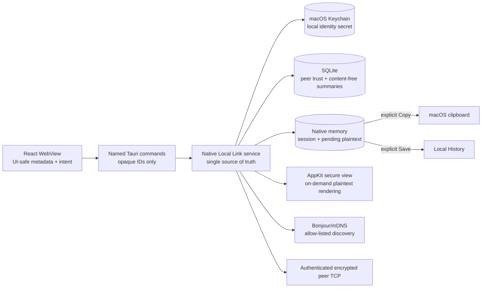

# Local Link v0.9 隐私与安全边界

- **状态：** Preview / Alpha 目标边界；不证明当前代码已启用网络
- **范围：** 一条显式选择的 UTF-8 文本在两台可信 Mac 之间的本地网络交接
- **相关产品规格：** [`../product/local-link-v09.md`](../product/local-link-v09.md)
- **相关状态规格：** [`../design/local-link-v09-state-matrix.md`](../design/local-link-v09-state-matrix.md)

本文定义 v0.9 实现不得突破的产品安全边界。具体 Noise 参数、frame schema 和威胁枚举仍应由
`docs/local-link/PROTOCOL.md` 与 `docs/local-link/THREAT_MODEL.md` 在实现阶段同步更新并接受评审。
本文本身不是网络、加密、Keychain、原生安全视图或双真机证据。

## 保护目标

1. 发送前和传输中的选中正文。
2. macOS Keychain 中的本机长期身份私钥。
3. 可信 peer 公钥绑定和用户的双方确认决定。
4. 接收端最长 60 秒的待决正文。
5. Copy、Save、Reject、Cancel、Revoke、Timeout 与 Receipt 的完整性和幂等性。
6. Core 可用性：Local Link 失败或受攻击时，History、Capture、Quick Paste 和 Recycle Bin
   继续工作。
7. 内容无关元数据：设备标签、Transfer 状态、诊断编号和瞬时网络 endpoint。

不承诺的边界：已被攻击者控制的 Mac、恶意/被攻陷的系统 Keychain、Copy 后其他应用读取系统
剪贴板、Save 后本机 History 的普通保留规则，以及 macOS swap、休眠镜像和 crash dump 的平台
行为。`memory-only` 只描述 ClipRiva 不主动序列化正文，不能扩张为“物理内存永不落盘”。

## 信任边界

本地网络、Bonjour 记录、IP、端口、显示名、六位 SAS 和 WebView 都不是信任锚。只有原生服务可
读取 Keychain 私钥、使用 raw socket、验证 peer key 和持有待决正文。

## 数据位置与生命周期

| 对象 | 允许位置 | 最长生命周期 / 删除事件 | 禁止位置或行为 |
| --- | --- | --- | --- |
| 本机身份私钥 | macOS Keychain；原生握手期间的受控内存副本 | 直至显式重置身份；内存副本连接结束清理 | SQLite、WebView、IPC、日志、诊断、源码、同步 Keychain |
| 本机/peer 公钥与指纹 | 原生内存；peer 绑定可在本地受保护配置/SQLite | 直至撤销、重置或身份迁移 | 私钥替代品、云目录、遥测、基于名称自动恢复信任 |
| Bonjour instance/endpoint | 原生内存与 OS 网络栈 | 当前运行或解析有效期；关闭/退出清理 | SQLite、Transfers、诊断、日志、WebView |
| 配对临时状态 | 原生内存 | 60 秒或成功/取消/失败 | 持久 code/hash、可重用 session credential、WebView trust anchor |
| 待发送正文 | 发送端原生内存 | 请求结束前且不超过 60 秒 | DOM、SQLite/WAL、文件、日志、诊断、离线队列 |
| 待接收正文 | 接收端原生内存和同进程 AppKit 安全视图 | 请求结束前且不超过 60 秒 | 系统通知正文、WebView/DOM/IPC、SQLite/WAL、文件、日志、诊断 |
| Copy 结果 | 系统剪贴板 | 由系统和后续用户写入控制 | 同一动作隐式写 History 或自动粘贴 |
| Save 结果 | 本机 History | 按普通本地保留/回收站规则 | 同一动作写系统剪贴板 |
| Transfer 摘要 | SQLite | 最近 20 条且最长 24 小时 | 正文、preview、digest、来源 App、路径、endpoint、key、旧正文队列 |
| Replay tombstone | SQLite | 最长 24 小时，独立于正文 TTL | 正文、digest、endpoint、key/session secret |
| 诊断编号 | Transfer 摘要或原生生成的有限字段 | 与摘要同生命周期；导出后由用户控制文件 | 可还原正文/指纹/endpoint，跨安装稳定用户标识 |
| 诊断包 | 用户显式选择的本地导出路径 | 用户控制；生成缓冲完成后清理 | 自动上传、正文、真实设备名、指纹、IP/端口、路径、Keychain 值 |

## 同意、权限与网络生命周期

1. 新安装和从 v0.6/v0.7/v0.8 Preview 升级均把真实 transport 设为关闭。旧 `enabled` 或
   `discovery_enabled` 不能作为当前版本 listener 同意。
2. 启动 App、打开 History/Quick Paste/Settings 或启用 Labs 不触发 Local Link 网络与
   Local Network 权限请求。
3. 用户明确开启后，先说明“局域网、无账户、无云中继”，再在上下文中请求系统权限。
4. 权限允许且 Keychain/配置有效后，原生服务才可启动 listener、Bonjour browse/publish；部分
   初始化失败必须回滚已启动资源并进入 fail-closed。
5. 权限拒绝或后续撤销不允许 plaintext fallback、Internet relay、旧协议或后台重试。
6. 关闭、权限撤销、退出、锁屏或用户切换立即停止/关闭适用的 discovery、listener、session 和
   原生安全视图，并原子清除待决正文；Core 与已保存 History 不受影响。
7. 最终候选 bundle 必须有准确、最小的 Local Network 使用说明和 Bonjour service type；权限
   文案、签名身份与实际网络行为必须在真实 macOS 上验证。

## Discovery 边界

- 只允许 `_clipriva._tcp.local.` 和经过评审的有限 TXT 字段；默认只暴露随机 instance、协议
  generation 和 pairing-window 标志。
- 设备显示名、SAS 和比较信息只在用户启动的 60 秒窗口内，或经过认证的可信 session 内提供。
- 不发布剪贴板正文、History 元数据、账户、稳定设备名、完整指纹、私钥或永久网络标识。
- endpoint 是瞬时路由事实，不进入持久化、Transfers、诊断或 WebView。
- 任意直接到达 listener 的连接都必须经过与 Bonjour 相同的认证；“未发现”不能放宽认证。

## 身份与配对边界

- 长期静态 identity 由 macOS Keychain 保护，版本化且不同步；Keychain 不可用、损坏或属性不符
  时 fail closed。
- 已有 peer 时，缺失 identity 不得静默生成新身份继续信任；必须显式重置并要求所有设备重配。
- 配对绑定 peer static public key、双方身份和握手转录，不绑定显示名、IP、port 或六码本身。
- 信任仅在同一 SAS/转录、固定身份和双方确认同时成立时原子提交。
- 取消、超时、不匹配、版本错误、重放或任一方拒绝清理临时状态并创建零 trust。
- 撤销使旧 peer key 立即无法新认证，关闭其 session、清除其待决正文，但不删除本机 History 或
  旋转本机 identity。

## 传输边界

- 每次只允许一条用户明确选择的 1–262,144 byte UTF-8 文本。
- 在构造 Offer/Body 前重新执行暂停、排除 App、敏感内容、类型与大小策略；UI、快捷键、fixture
  或 retry 不能绕过。
- 只允许经评审的相互认证加密协议和 pinned peer identity；没有 plaintext、legacy 或降级
  fallback。
- Offer 先于 Body；版本、锁屏、信任、receiver capacity、rate 和 TTL 在接收正文前检查。
- 每 peer 最多一个 pending、全局最多三个 pending、每 peer 每分钟最多五个 Offer；超限在保留
  正文前拒绝。
- session ID、transfer ID、nonce、timestamp/TTL、replay tombstone 和原子决策共同保证单次使用。
- retry 是从当前仍存在的 Item 发起的新请求；不从 Transfers 恢复 payload。

## 原生安全视图与 DOM 禁区

原生安全视图是 v0.9 新边界，必须在网络激活前有独立代码评审和 sentinel 测试。

当前工程检查点只实现部分 seam：React 传 opaque ID、Tauri 返回 `void`、终态/已过期/已撤销后
无法再新开 Reveal。当前 AppKit `NSAlert` 没有原生视图 registry 或可由 lifecycle 关闭的 handle，
显示前会创建短生命周期 zeroizing 副本；因此下面第 2～4 项的屏幕/用户状态、无额外复制及已打开
视图强制关闭仍是目标约束，不得记录为本轮已验收。

1. React/WebView 只发送 `reveal(transfer_id)` 意图。IPC 请求和响应均不含正文、preview 或正文
   派生值。
2. 完整目标要求原生服务验证 transfer 仍为 `awaitingReceiver`、peer 仍可信、TTL 未过期、
   屏幕/用户 session 可用后，才把受控 native buffer 渲染到 AppKit 安全视图。
3. 完整目标要求 Reveal 不产生额外长生命周期副本、不持久化、不产生 Receipt、不延长 TTL，也
   不创建 accessibility 或日志文本缓存。若系统 API 无法避免必要的短暂辅助功能暴露，必须记录
   范围并重新评审。
4. 视图关闭、锁屏、用户切换、超时、Cancel、Revoke、Disconnect、Disable、Exit 或任一终态都
   同步隐藏视图并清除正文。
5. WebView devtools、DOM snapshot、Tauri event、panic/error、system notification、screenshot
   fixture、Transfers 和诊断中 unique sentinel 出现一次即绝对 No-Go。

## 接收动作与原子赢家

| 动作 | 允许副作用 | 禁止副作用 | Receipt |
| --- | --- | --- | --- |
| Copy | 系统剪贴板精确写入一次，并消费一次 self-capture suppression | History 写入、自动粘贴、重复写 | `copied` |
| Save | 按冻结的显式接收策略写入本机 History 一次 | 系统剪贴板写入、重复 Item 副作用 | `saved` |
| Reject / Escape | 无内容写入；清除正文 | Clipboard/History 写入 | `rejected` |
| Sender Cancel | 清除正文与 session | 后续 Copy/Save | `cancelled` |
| Timeout | 清除正文与 session | 恢复或延长旧正文 | `expired` |
| Revoke/Disable/Lock/Disconnect/Exit | 清除正文并关闭适用资源 | 后续写入或旧身份继续认证 | `notDelivered` 或经协议定义的取消终态 |

Copy、Save、Reject、Cancel、Timeout、Revoke、Disable、Lock、Disconnect 和 Exit 竞争同一个 native
decision claim。第一个成功提交者是唯一赢家；所有迟到动作只获得 content-free `already final`
结果。Receipt 丢失不允许重做副作用；幂等终态查询必须收敛到同一结果。

Save 是否可被本地敏感内容策略阻止必须在实现前冻结：建议将用户显式 Save 仍交给既有本地
History policy；若被阻止，则不写 Clipboard/History，返回有限 `captureBlocked` 结果并使双方状态
一致。不得静默把 Save 降级为 Copy。

## 通知边界

- 通知授权仅在用户已开启 Local Link 且需要后台提醒时请求；拒绝后使用无正文应用内指示。
- 通知只能显示可信设备的合成/本地显示标签、固定“发来一段文本”和倒计时；不得显示正文、
  首行、来源 App、路径、大小精确值、指纹、endpoint 或诊断详情。
- 点击通知只携带 opaque transfer ID，仍由原生服务验证状态；过期或撤销请求不能打开正文。
- 通知服务不可成为云推送、遥测或后台正文队列。

## Transfers、日志与诊断

Transfers 与诊断都使用固定字段白名单。

允许字段：应用/协议版本、构建号、macOS 大版本、架构、网络接口类型、宽泛阶段、有限状态/失败
原因、单调耗时、聚合计数、方向、字节区间和随机诊断编号。

禁止字段：正文、ciphertext、preview、digest、剪贴板 hash、transfer/session/nonce 原值、真实设备
名、完整/短指纹、IP/port、Bonjour instance、来源 App、文档名、文件路径、Keychain 值、private/
session key、raw library error。

诊断包只可用户显式导出到本地，不自动上传。导出实现属于 data export 边界，必须与
`PRIVACY.md`、数据流、开源模块边界和测试同任务更新后才可启用。

## 绝对 No-Go

出现以下任一项，候选保持 Preview/Alpha、默认关闭且不得更改 Beta 文案：

- 明文、私钥或 session secret 出现在 packet capture、SQLite/WAL、非 Save 文件、日志、诊断、
  DOM/IPC 或非目标位置。
- 错误设备建立信任、未认证 transport、协议降级或 plaintext fallback。
- 同一请求重复 Copy/Save，或 Cancel/Revoke/Timeout/Lock 后仍写入。
- 撤销后旧身份仍能认证或旧正文复活。
- 失败被报告为 Copied/Saved/Delivered，或双方终态互相矛盾。
- Local Link 在默认关闭、升级未重新同意或系统权限拒绝时监听/发现/连接。
- Receipt 丢失/乱序无法收敛却猜测终态。
- 真实双 Mac、签名候选、50 配对、200 传输和隐私矩阵未完成前使用 Beta 可用口径。

## 证据规则

- 自动化和同机双进程只能证明解析、状态、幂等和实现边界，不能证明远端 Mac、签名权限或真实
  局域网行为。
- 物理证据必须来自两台不同真实 Mac、独立应用数据/Keychain identity、相同候选 Git SHA 和
  签名 bundle，只使用合成正文与设备标签。
- 抓包只保存脱敏摘要；不得提交真实 private key、fingerprint、IP、设备名或原始剪贴板内容。
- 普通磁盘扫描不能证明 swap/hibernation/crash dump 绝不含内存；报告必须保留平台限定。
- 所有证据默认 No-Go，只有维护者在
  [`../release/local-link-beta-evidence.md`](../release/local-link-beta-evidence.md) 明确签字才可改变。

## 同步更新触发器

任何网络 request、Bonjour 字段、listener scope、权限、通知、导出、stored data type、Keychain
生命周期、正文位置、内容格式、retention、diagnostic 字段或协议 fallback 变化，都必须在同一
任务更新 `PRIVACY.md`、`docs/privacy/data-flow.md`、`docs/open-source/module-boundary.md`、协议、
威胁模型和边界测试。依赖或锁文件变化还必须执行仓库规定的 license/SBOM 复核。
